# js

不要怕一些概念，都是纸老虎

## 目标：

- 看这个链接

​		[阮一峰 ECMAScript 6 (ES6) 标准入门教程 第三版](https://www.bookstack.cn/books/es6-3rd)

- 回答下图的问题


## 1、js是一种单线程语言

为避免多线程同时操作dom等冲突问题，js被设计成单线程语言。

`浏览器提供了机制（时间循环、web worker），让js可以模拟多线程`

## 2、事件循环

**事件循环流程**：
同步代码 → 清空微任务队列 → 执行下一个宏任务 → 重复循环


## 3、解构赋值

**数组解构（Array）**、**对象解构（Object）**

基础学习：https://www.runoob.com/w3cnote/deconstruction-assignment.html

```js
let [a] = [] // a = undefined
```

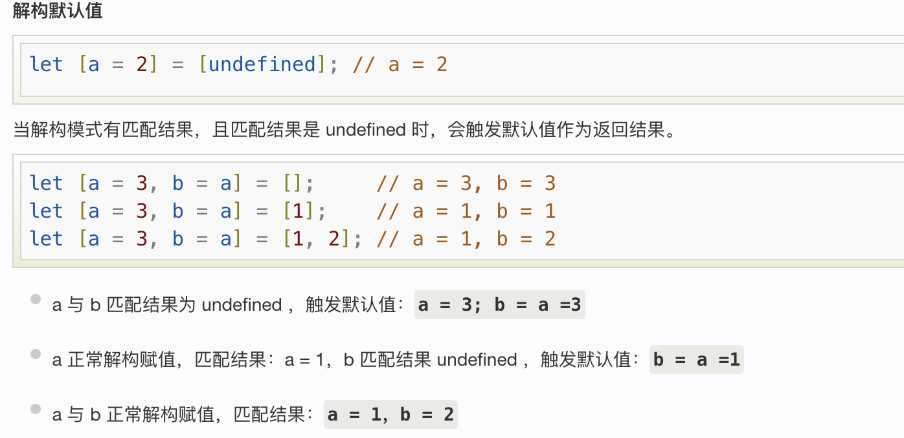

practice：

```js
// x会在未知变量和默认值之间，会优先默认值
let [x = 5, y = 10] = [undefined, 20];
console.log(x, y); // 答案：5, 20

let { a: newA = 1, b = 2 } = { a: null };
console.log(newA, b); // 答案：null, 2（注意：null 不会触发默认值）
// null是一个明确的值，表示没有有效对象
// undefined是未定义，表示变量声明但是未赋值/属性不存在

const [a, b, ...rest] = 'hello';
console.log(a, rest); // 答案："h", ["e", "l", "l", "o"]
// rest是一个数组

// 函数参数解构
function show({ a = 3, b = 4 } = { a: 1, b: 2 }) {
  console.log(a, b);
}
show({ b: 10 }); // 答案：3, 10 
show(); // 1,2

// 对象属性名匹配
let { x, y } = { a: 1, b: 2 };
console.log(x, y); // 答案：undefined, undefined

```

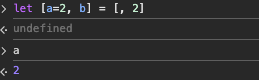

使用场景

```js
// 交换变量
let a = 5, b = 10;
[a, b] = [b, a]; // 答案：a=10, b=5 

// 获取api中的响应数据
const response = { data: { items: [{ title: "Post1" }, { title: "Post2" }] } };
const { data: { items: [firstPost] } } = response;
console.log(firstPost.title); // 答案："Post1" 
```

# 题目

## 1、js有多少数据类型？区别是什么？

基本数据类型：string、number、boolean、undefined、null、symbol、bigint

引用数据类型：Object、Function、Array

7（基本数据类型）+3（引用数据类型）

**栈**				 **堆**

基本数据类型 直接存储在栈中

引用数据类型 对象放在堆中，会有一个指针指向这个堆的地址，指针存在在栈中

## 2、 判断数据类型

（1）typeof 判断基本数据类型

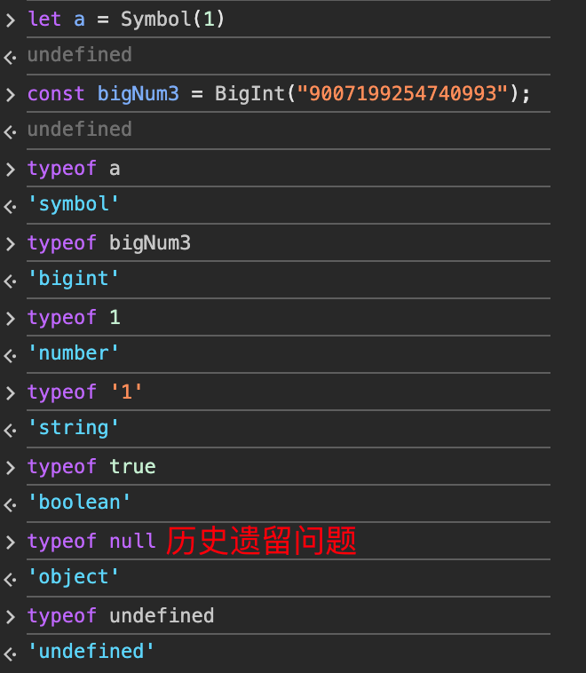

使用typeof判断引用数据类型 返回 object

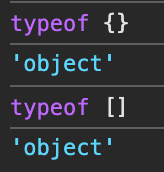

（2）insatnceof 判断引用数据类型

内部的运行机制是 判断能否在原型链上找到原型

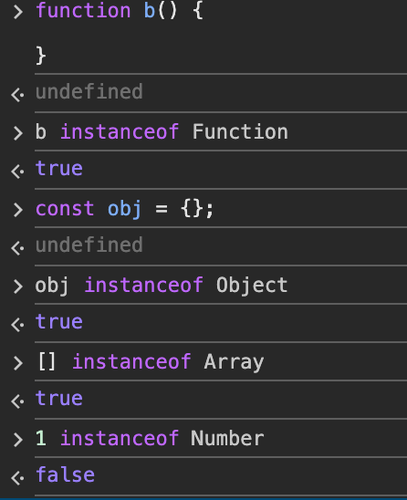

引用数据类型原型链，原始数据没有，所以不可以用instanceof判断

instanceof就是依据原型链去判断

```js
let a = []
a instanceof Array

// 模拟实现
function instanceof(obj, Constructor) {
  let leftP = obj.__proto__
  let rightP = Constructor.prototype
  if (leftP === null) {
    return false // 到头了
  }
  if (leftP === rightP) {
    return true
  }
  return instanceof(obj.__proto__, Constructor)
}
```

（3）根据原型链判断

```js
// 构造函数
let a = 1
a.constructor === Number //true
a = '1'
a.constructor === String // true

// 原型
a.__proto__ === String.prototype // true
a=1
a.__proto__ === Number.prototype // true

```


## 3、js的原型链

https://segmentfault.com/a/1190000042725370

> js的一切引用类型都是对象，对象是属性的集合

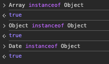

分析：Object是a的原型

- 调用a的方法hello，a本身有，直接返回
- 调用a.world，a本身没有，向原型Object找，也没有，返回undefined

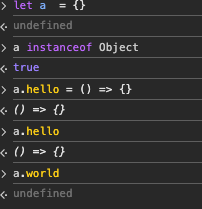

**这条由对象及其原型组成的链就叫做原型链。**

> 原型链存在的意义：继承；共享属性
>

js的基础对象有下列这些，可以直接window引用，同时也是构造函数

Object、Function、Array、String、Number、Boolean、Symbol、Error、Date、Json、Map、Set...

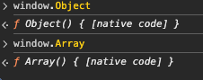

举例子：

```js
function Person(name) {
  this.name = name
  this.sayName = function() {
    console.log(this.name)
  }
}

let person = new Person('logan1')
let person2 = new Person('logan2')
// 1-Person是示例化对象person的构造函数
person.constructor
// ƒ Person(name) {
//  this.name = name
//  this.sayName = function() {
//    console.log(this.name)
//  }
// }
// 
// 2-原型
person__proto__ 	// {}		示例化对象的原型写法
Person.prototype // {}  构造函数的原型写法
person.__proto__ === Person.prototype  // true

使用Object.getPrototypeOf() 获取原型
Object.getPrototypeOf(person) === person.__proto__  // true
```

- 构造函数用来示例化对象，有自己方法和属性
- 原型是用来共享对象和属性的

也就是说

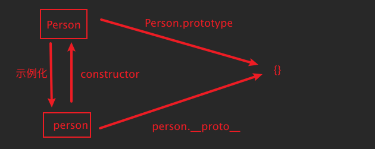

如果想要属性，在Person.prototype中写入，如果想要有自己的属性，在Person中写入

```js
Person.prototype.drink = function() {
    console.log('喝东西')
}
// 这样的话，person有共享方法drink，私有属性name
```

太搞笑了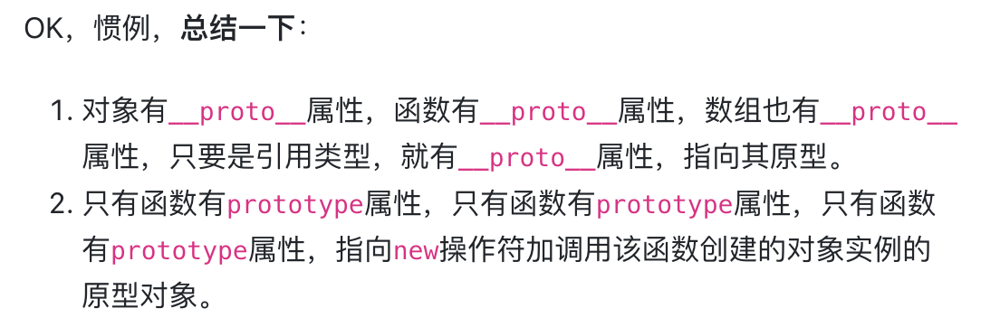

原型链到头

```js
person.__proto__ === Person.prototype
// 共同指向 {}
Person.prototype.__proto__ === Object.prototype

// 最终
Object.prototype.__proto__ === null  // null是始祖
```

practice：

```js
let fn = function() {}

fn.__proto__ === Function.prototype // true
Array.__proto__ === Function.prototype // true
String.__proto__ === Function.prototype // true
Object.__proto__ === Function.prototype // true
// js提供的全局对象都是构造函数

let Foo = function() {}
let f1 = new Foo()
let f2 = new Foo()
f1.__proto__ === f2.__proto__  === Foo.prototype ? // true
Foo.prototype === Object.prototype ? // true
Object.prototype.__proto__ === null ?  // true
// f1.__proto__,f2.__proto__,Foo.prototype,Object.prototype 指向的都是一个对象
```

## 4、判断数组的方式有哪些？

```js
let a = []
Array.isArray(a)									 // true
a.constructor === Array						 // true
a.__proto__ === Array.prototype  	 // true
Object.prototype.toString.call(a)  // '[object Array]'
```

## 5、null和undefined的区别

都是基本数据类型

undefined：未定义

null：主要用于赋值给一些可能会返回对象的变量，作为初始化

```js
typeof undefined // undefined
typeof null // object
```

## 6、intanceof 操作符的实现原理及实现

判断构造函数的原型有没有在对象的原型链上

```js
function myInstcenceof(left, right) {
	let proto = Object.getPrototypeOf(left)
  let prototype = right.prototype
  while(true) {
    if (!proto) return false
    if (proto === prototype) return true
    proto = Object.getPrototypeOf(proto)
  }
}
```

## 7、0.1+0.2 ! == 0.3

- js使用64位双精度浮点数表示数字

- 二进制存储小数，无法被精确表示，相加之后会产生误差，所以不等于0.3

之前在做关于价格计算的时候会有精度的问题，使用第三方库解决**`decimal.js`**

## 8、typeof NaN

NaN not a Number 执行数字运算没有成功，失败后返回的结果

```js
typeof NaN // 'number'
1 * 'a1' // NaN
```

判断一个变量是不是NaN

```js
isNaN()
```

## 9、js的包装类型

意思是 将基本数据类型转成对象

```js
let a = 'abc'
a.length // 3
a.toUpperCase() // 'ABC'
```

在执行a .length的时候，js在后台把a装成String('abc')，才能执行字符串的属性

## 10、object.assign和扩展运算法是深拷贝还是浅拷贝，两者区别

用来拷贝对象，且都是浅拷贝，***只拷贝对象的第一层***，对于嵌套的对象或数组，复制的是引用而非创建新对象。

```js
const original = {
  name: 'John',
  address: {
    city: 'New York'
  }
};

//object.assign -------------------------
let a = Object.assign({}, original)
a.name = 1
original.name // 'Join'

a.address.city = 2
original.address.city // 2

// 解释：original的第一层name被创建，嵌套的address就只是复制了引用地址，original.address.city被改变

//扩展运算符 -------------------------
let b = {...original}
b.name = 2
original.name // 'Join'
b.address.city = 3
original.address.city // 3
// 解释：...创建了name变量，address复制引用地址
```

区别在于

Object.assigin 会执行目标对象的set

```js
const target = {
  set current(value) {   //  给目标对象设置一个set属性
    console.log('Setter triggered:', value);
  }
};
```

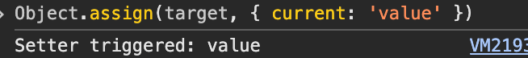

## 11、浅拷贝和深拷贝

浅拷贝：只拷贝对象的第一层，嵌套的对象只复制引用地址，修改嵌套对象会影响原来的值

深拷贝：递归复制对象的所有层级，在内存中创建一个完全一致的空间存储，修改嵌套对象不会影响原来的值

```js
// 浅拷贝
// 1 Object.assign
let a = [1, {a: 2}]
Object.assign([], a)
// 2 扩展运算符
let b = [...a]

// 深拷贝
// 1 JSON.parse(JSON.stringify())
JSON.parse(JSON.stringify(a)) 
// 局限性 
//（1）不能处理函数、一些对象会丢失或者转换
// undefined => {} 
// {d: new Date()} → {"d": "2023-01-01T00:00:00.000Z"} 
// {fn: () => {}} → {}
//（2）丢失原型链和构造函数，变成一个纯Object对象

// 2 使用第三方库
Lodash.cloneDeep

// 3 自己写递归函数
function deepClone(obj) {
  if (obj === null || typeof obj !== 'object') return obj;
  const result = Array.isArray(obj) ? [] : {};
  for (let key in obj) {
    if (obj.hasOwnProperty(key)) {
      result[key] = deepClone(obj[key]);
    }
  }
  return result;
}

```

## 12、let、const、var的区别

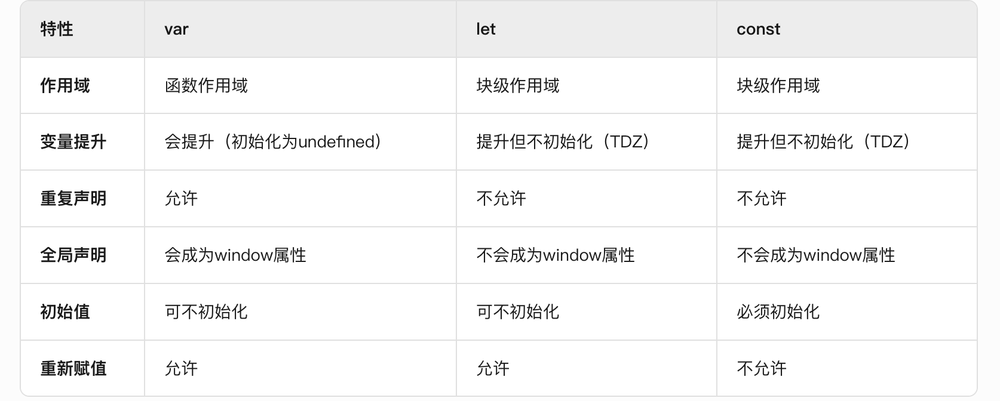

## 13、const不可以重新赋值的吗

const变量如果是个基本数据类型，是不可以改变的

如果是个引用数据类型，变量指向的这个对象的地址不可以改变，变量的属性可以改变

## 14、new一个箭头函数会怎样

new一个对象的过程

- 首先创建了一个新的空对象
- 设置原型，将对象的原型设置为函数的 prototype 对象。
- this指向这个对象，执行构造函数的代码，为新对象添加属性
- 判断函数的返回值类型，如果是值类型，返回创建的对象。如果是引用类型，就返回这个引用类型的对象。

箭头函数没有构造函数、this、arguments，无法new一个构造函数

## 15、箭头函数跟普通函数的区别

- 写法简单

- 没有自己的this，只会指向上一层继承来的this

  ```js
  var id = 'GLOBAL';
  var obj = {
    id: 'OBJ',
    a: function(){
      console.log(this.id);
    },
    b: () => {
      console.log(this.id);
    }
  };
  obj.a();    // 'OBJ'
  obj.b();		// 'GLOBAL'
  ```

- 不能作为构造函数

  ```js
  function Person (name) {this.name = name}
  let p = new Person('p')
  p // Person {name: 'p'}
  
  const d = (name) => { this.name = name}
  p = new d('aa')  // Uncaught TypeError: d is not a constructor
  ```

- 没有自己的arguments

  ```js
  function name(params) {
      console.log(arguments)
  }
  name(11)
  ```

  

  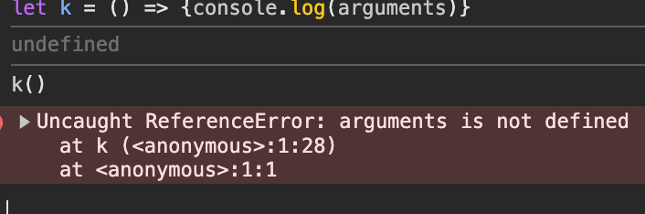

## 16、... rest运算符号

把分离的参数序列整合成一个数据

```js
function mutiple(...args) {
  console.log(args)
}
mutiple(1, 2, 3, 4) // [1, 2, 3, 4]
```

## 17、map和object的区别

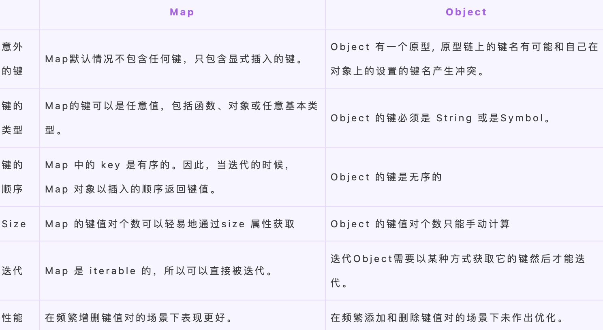

## 18、对json结构的理解

是一种轻量级的文本数据交换方式，用来进行前后端传递数据的。可以被任何的编程语言读取和作为数据格式来传递。

请求接口的时候，在请求头中加入content-type为application/json，就会把json对象转换成json字符串进行传递，后端再使用JSON.parse解析成JSON对象

这个会涉及到一个响应头：content-type，这个是用来标识请求或响应中传输的数据是什么数据类型和字符编码

比如在请求头中常见的：

```js
Content-Type: application/json  # 请求体是 JSON
Content-Type: multipart/form-data  # 文件上传
Content-Type: application/x-www-form-urlencoded  # 表单提交
```

响应头中

```js
Content-Type: text/html; charset=utf-8  # 返回 HTML 页面
Content-Type: application/pdf  # 返回 PDF 文件
```

## 19、数组的原生方法有哪些？

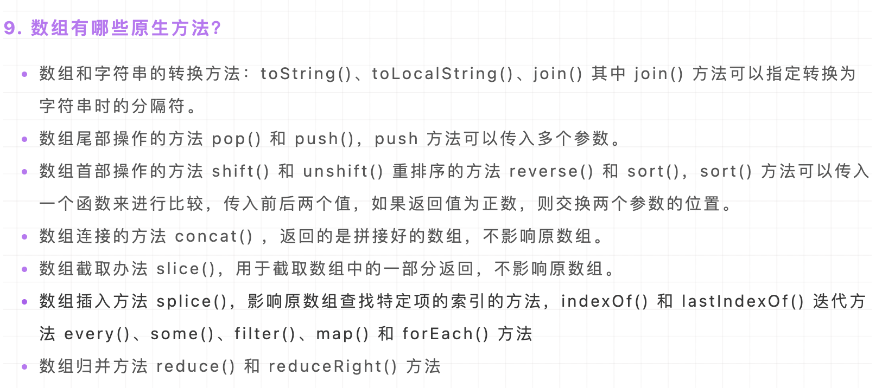

## 20、函数的arguments参数是类数组，如何遍历它？

普通函数中的执行域中会有自己的arguments，这是一个类数组，

类数组：是一个对象，属性是从0递增的数组，有length属性，但是没有数组的方法

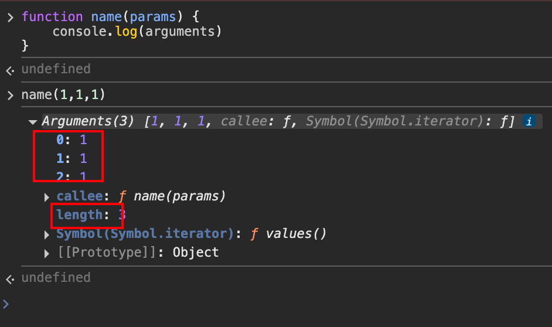

如何遍历？

```js
function name () {
  Array.prototype.forEach.call(arguments, a => console.log(a))
  Array.from(arguments)
  [...arguments]
}
```

## 21、BOM和DOM

BOM：browser object model 浏览器对象模型（浏览器窗口和浏览器环境）

window、location、navigator、screen、history、document

DOM：document object model 文档对象模型（网页内容）

document、event（网页事件）、element

## 22、浏览器执行js的完整过程

加载：loading

​	浏览器解析 HTML 时遇到 `<script>` 标签，会暂停 HTML 解析，开始加载 JavaScript 文件（如果是外部脚本）。

解析和编译

​	变量提升、**作用域链**、**变量提升**

执行

JavaScript 引擎通过 **调用栈（Call Stack）** 和 **事件循环（Event Loop）** 管理代码执行

## 23、**ES6**模块与**CommonJS**模块

首先，有两种js执行环境：nodejs和浏览器，对于支持的模块引入方式不同

ES6 模块（ESM）和 CommonJS（CJS）是 JavaScript 的两种主流模块系统，分别用于浏览器端和 Node.js 环境。

区别在于，es6模块导出引用，commonjs导出拷贝

```js
// ES6 模块（动态绑定）
// module.js
export let count = 0;
export function increment() { count++; }

// main.js
import { count, increment } from './module.js';
console.log(count); // 0
increment();
console.log(count); // 1（值被更新）

// CommonJS（值拷贝）
// module.js
let count = 0;
module.exports = { count, increment: () => { count++; } };

// main.js
const { count, increment } = require('./module');
console.log(count); // 0
increment();
console.log(count); // 0（拷贝的值未变）
```

## 24、for..in和for..of

用来遍历具有iterator接口的数据结构（对象、数组）

- for…of 遍历获取的是对象的键值，for…in 获取的是对象的键名
- for… in 会遍历对象的整个原型链，性能非常差不推荐使用

## 25、什么是闭包

- 是有权访问另一个函数作用域中的变量的函数
- 是使已经运行结束的函数上下文中的变量对象继续留在内存中，因为闭包函数保留了这个变量对象的引用，所以这个变量对象不会被回收。

```js
function A() {
  let a = 1
  window.B = function () {
      console.log(a)
  }
}
A()
B() // 1
```

## 26、对作用域、作用域链的理解

## 27、改变this的指向

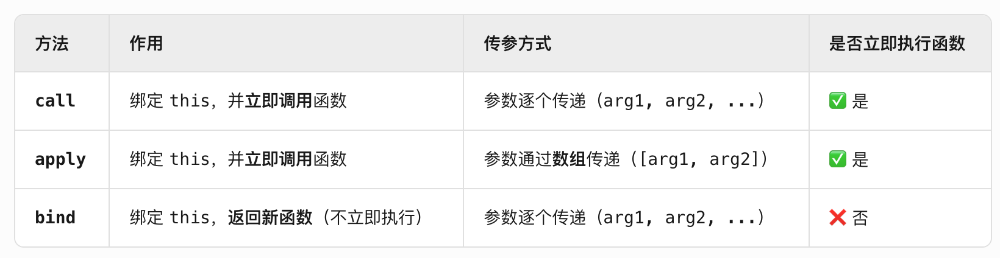

## 28、异步编程的方法

定时器setTimeout

```js
console.log('script start')	//1. 打印 script start
setTimeout(function(){
    console.log('settimeout')	// 4. 打印 settimeout
})	// 2. 调用 setTimeout 函数，并定义其完成后执行的回调函数
console.log('script end')	//3. 打印 script start
// 输出顺序：script start->script end->settimeout

```

Promise

async/await

generator

## 29、Promise

有三种状态：pending、resolved、rejected

```js
const promise = new Promise(function(resolve, reject) {
  // ... some code
  if (/* 异步操作成功 */){
    resolve(value);
  } else {
    reject(error);
  }
});

```

常用的方法

then、catch、all、race、finally

race：如果第一个`promise`对象状态变成`resolved`，那自身的状态变成了`resolved`；反之第一个`promise`变成`rejected`，那自身状态就会变成`rejected`。

