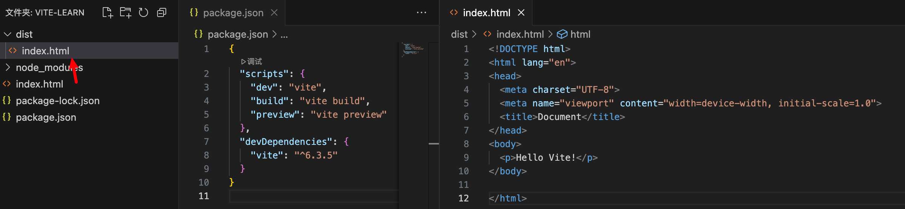
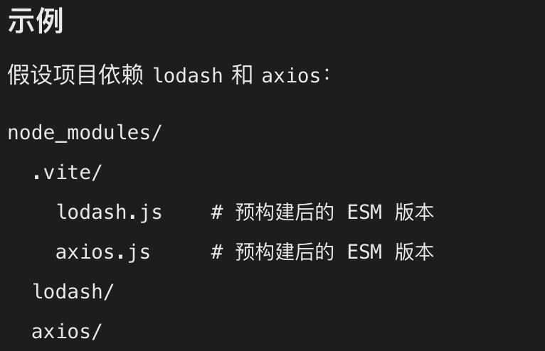
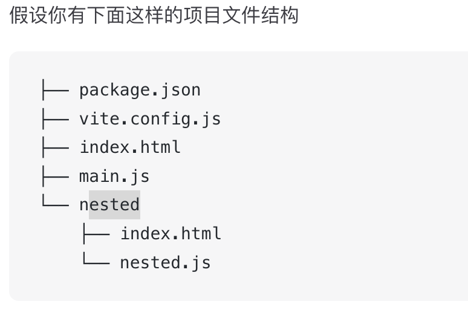
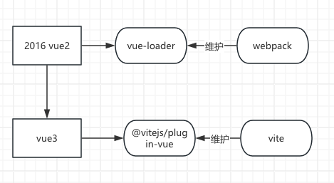

# 一、vite

vite官方：https://cn.vitejs.dev/

vue官方：https://cn.vuejs.org/

- 通过vue构建vue+vite项目

  ```bash
  npm create vue@latest
  ```

- 通过vite构建vue+vite项目

  ```bash
  npm create vite@latest  my-vue-app -- --template vue
  ```

## 1、概念

安装vite，编写index.html，编写script



将根目录的文件下的东西打包到dist

> vite作为一个开发服务器

使用npm run previw预览产物

vite就是把各种框架的文件打包成html、css、js，浏览器能够识别的文件

## 2、功能

### 2.1、依赖解析与预构建

vite支持ESM作为核心模块系统，但是npm包中仍使用commonjs，需要兼容这些npm包的语法

- 依赖解析

  解析引入文件的真正可用路径

  当代码中出现 `import lodash from 'lodash'` 时，Vite 会：

  1. 检查 `node_modules` 找到 `lodash` 的真实路径。
  2. 确保它最终指向一个 **浏览器可用的 ESM 文件**。

  ```js
  // 源码
  import lodash from 'lodash';
  
  // Vite 转换后（开发环境）
  import lodash from '/node_modules/.vite/lodash.js?v=123456'; // 浏览器可以解析识别的
  ```

- 预构建（pre-building）

  1. 扫描 `package.json` 的 `dependencies`，找出所有依赖。
  2. 使用 esbuild将这些依赖：
     - 从 CJS/UMD 转换为 ESM 格式。
     - 合并成一个或多个文件（减少 HTTP 请求）。
  3. 缓存结果到 `node_modules/.vite` 目录。

  

​	

### 2.2、HMR：hot module replacement 热模块替换

```js
"@vitejs/plugin-vue" // 深度集成 Vue 框架的 HMR 逻辑。

// vite.config.js
import vue from '@vitejs/plugin-vue'
  plugins: [
		vue()
	]
```

vite的热模块更新是基于`import.meta.hot`实现

> `import.meta` 是 **ECMAScript 模块（ESM）** 的原生特性，由 JavaScript 运行时（如浏览器、Deno、Node.js 等）提供。

### 2.3、TS

Vite 仅执行 `.ts` 文件的转译工作，**并不执行** 任何类型检查。

### 2.4、html

index.html是入口文件，可以在根目录下建立另一个html文件，可轻松构建单页和[多页应用程序](https://cn.vitejs.dev/guide/build.html#multi-page-app)。

但是需要添加对这个html文件的配置

```js
export default {
  build: {
    rollupOptions: {
      input: {
        main: './index.html',
        about: './about.html',
      },
    },
  },
};
```

- 访问 `/about.html` 时会加载独立的资源，**与 `index.html` 完全隔离**。

例子：



```js
const __dirname = dirname(fileURLToPath(import.meta.url))

export default defineConfig({
  build: {
    rollupOptions: {
      input: {
        main: resolve(__dirname, 'index.html'),
        nested: resolve(__dirname, 'nested/index.html'),
      },
    },
  },
})
```

### 2.5、框架支持

官方vite维护vue、react

## 3、使用插件

文档里面提到一个例子，使用`@vitejs/plugin-legacy`，有些es6语法等不被旧的浏览器支持

> **@vitejs/plugin-legacy** 是 Vite 官方提供的一个插件，用于为现代浏览器构建的代码**自动生成兼容旧浏览器的备用版本**，确保应用在传统浏览器（如 IE 11、旧版 Chrome/Safari）中也能正常运行。

## 4、部署静态站点

- 本地构建部署

  build然后preview，是预览构建完的产物， 在本地启动一个静态 Web 服务器，指定端口映射到这个dist文件

- 部署到服务，开启nginx端口映射

## 5、环境变量和模式


# 二、引申：

## 1、vue打包工具的历史



## 2、兼容

- 语法兼容：js、css、html的兼容

  比如build.target配置构建目标，最低支持到es2015

- 传统浏览器的兼容

  使用插件[@vitejs/plugin-legacy](https://github.com/vitejs/vite/tree/main/packages/plugin-legacy) 
