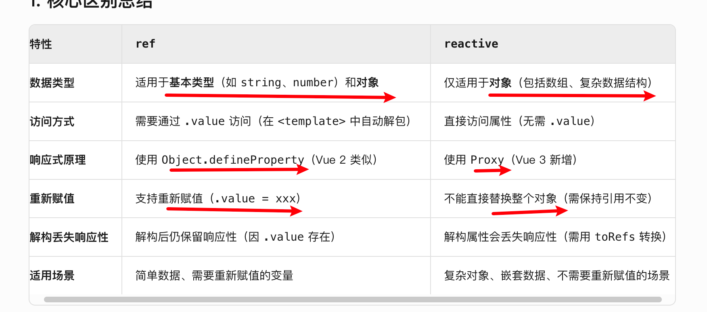
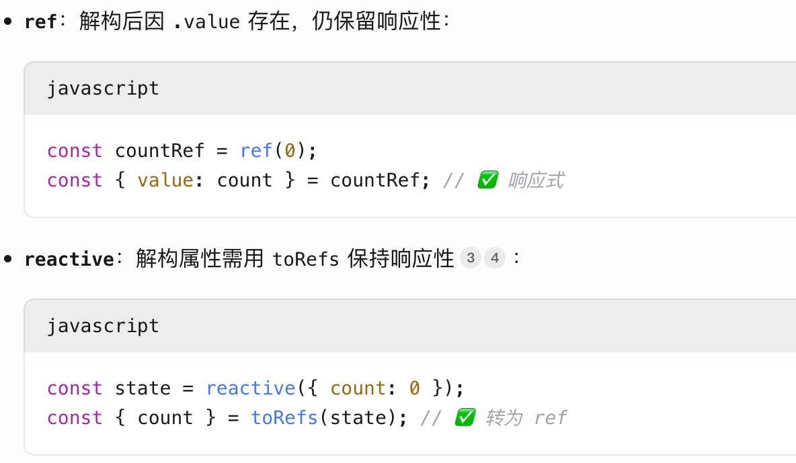
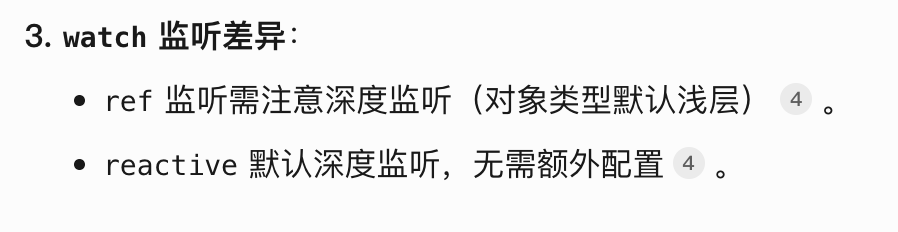

五十道题目：https://juejin.cn/post/7458326985077587983

## 1、vue3的主要新特性是什么

## 2、composition api 组成式api

Vue2 主要是 options api

```js
export default {
  data() {
    return {};
  },
  computed: {},
  methods: {},
  mounted() {},
};
```

Vue3 可以兼容option api 和 composition api

```js
export default {
  setup() {
    const count = ref(0);
    onMounted(() => {
      console.log("组件已挂载");
    });
    return { count, doubleCount, increment };
  },
};
```

反正记住组合式api有setup，可以直接在script中写setup

组合式api的核心优势：

- 可以使用自定义hook去复用逻辑

  ```js
  // useCounter.js
  import { ref, computed } from "vue";
  
  export function useCounter() {
    const count = ref(0);
    return { count };
  }
  
  // 在组件中使用
  import { useCounter } from "./useCounter";
  
  export default {
    setup() {
      const { count } = useCounter();
      return { count};
    },
  };
  ```

- 更好的ts支持

- 自由的代码组织

  业务逻辑相关的代码块可以放在一起，变量和函数就不会散落

settup是组件创建前执行

## 3、ref和reactive的区别

都是用于创建响应式数据的核心函数



- 重新赋值区别

  ```js
  const data = ref({ name: "A" });
  data.value = { name: "B" }; // ✅ 视图更新
  
  const state = reactive({ name: "A" });
  state = { name: "B" }; // ❌ 失效！
  
  // 正确做法：修改属性或使用 Object.assign
  Object.assign(state, { name: "B" }); // ✅
  ```

- 解构

  

- 响应式的实现是不一样的：下一点说到

- ref中如果嵌套了对象的话，也有用reactive包裹

- 

## 4、ref和reactive的响应区别

### vue2的响应式原理

ref：使用object.defineProperty对象的value属性进行劫持，拦截value属性的访问和修改

```js
let obj = {};
let _internalValue = 0; // 闭包变量存储实际值

Object.defineProperty(obj, 'value', {
  get() {
    console.log('读取 .value 属性');
    return _internalValue; // 返回闭包变量值
  },
  set(newValue) {
    console.log(`修改 .value 属性为 ${newValue}`);
    if (typeof newValue !== 'number') {
      throw new Error('.value 必须为数字');
    }
    _internalValue = newValue; // 更新闭包变量
  },
  enumerable: true,
  configurable: true
});

// 测试劫持效果
obj.value = 42; // 触发 set，输出："修改 .value 属性为 42"
console.log(obj.value); // 触发 get，输出："读取 .value 属性" → 返回 42
obj.value = 'text'; // 触发 set，抛出错误：".value 必须为数字"
```

每个属性都会有一个dep：依赖管理器

```js
function defineReactive(obj, key, val) {
  const dep = new Dep() // 每个属性对应一个 Dep（依赖管理器）

  Object.defineProperty(obj, key, {
    enumerable: true,
    configurable: true,
    get: function reactiveGetter() {
      if (Dep.target) { // 当前正在计算的 Watcher（如组件渲染函数）
        dep.depend() // 收集依赖
      }
      return val
    },
    set: function reactiveSetter(newVal) {
      if (newVal === val) return // 值未变化，直接返回
      val = newVal // 更新闭包变量
      dep.notify() // 通知所有依赖更新
    }
  })
}
假设一个ref在页面中被渲染
1:{{count}} 那么就是调用了变量的get，dep就会收集依赖
2:如果count在js中被改变了值，就会执行set，dep就会通知这些依赖，执行的操作比如是更新页面

假设这个变量被用来computed，count1 = computed(() => count.value++)，那么就会通知这个依赖，去更新count1

```

*从set到页面更新的完整流程

- 改变一个ref变量
- 触发变量的dep去通知notify依赖
- watcher执行更新：比如render、computed、watch
- 生成新的dom树，对比新旧树，计算最小dom操作，更新页面 

### vue3的响应式原理

## 5、v-if和v-show的理解

## 6、vue实例挂载的过程

