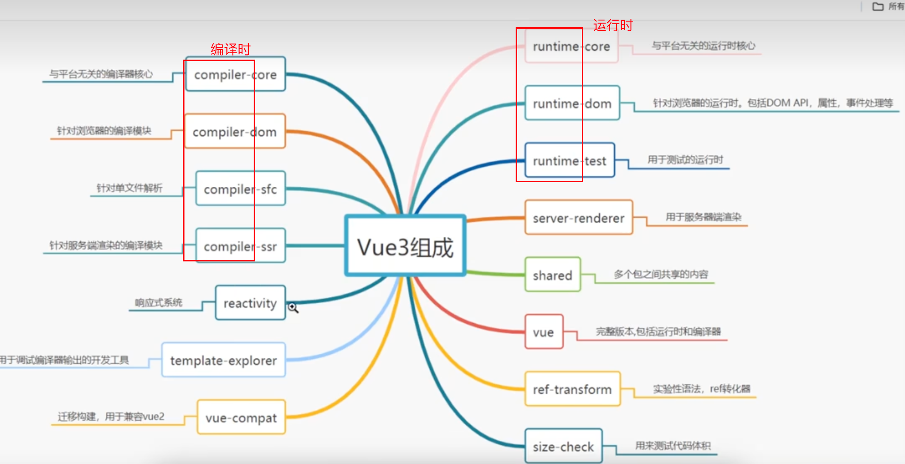
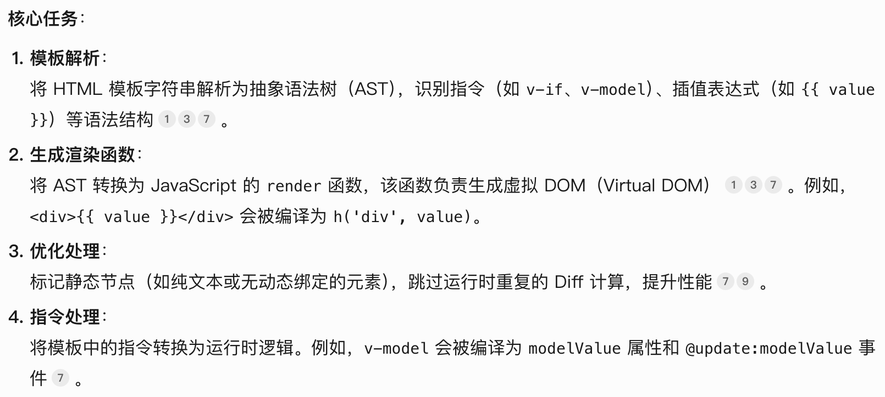
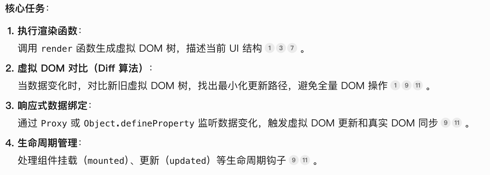
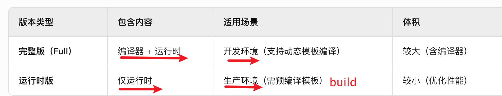
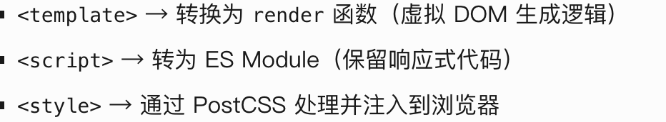
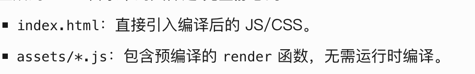
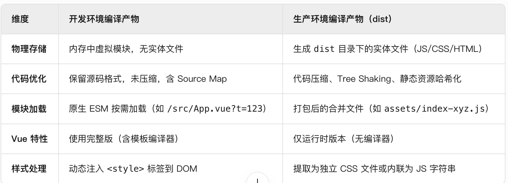
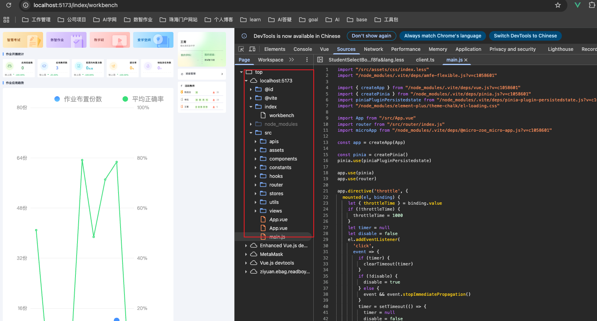

##  vue

https://cn.vuejs.org/guide/introduction.html

## 1、vue是一个声明式框架

只需要使用vue提供的一些语法就可以实现页面，不用自己一个一个写

## 2、vue实现高效渲染的核心机制：虚拟dom的实现

### 2-1 虚拟dom树

virtual dom是一个轻量级的js对象，用于描述真实dom的结构和属性

```js
//这是一段html代码  
<ul>
  <li key='1'>hello</li>
	<li key='2'>world</li>
</ul>

// 虚拟dom节点长这样
{
  tag: "ul",              // 外层标签名
  props: {},              // 外层属性（此处无显式属性）
  children: [             // 子节点数组
    {
      tag: "li",          // 第一个 li 节点
      props: { key: "1" }, // 唯一标识符 key
      children: ["hello"]  // 文本内容直接以字符串形式存储
    },
    {
      tag: "li",
      props: { key: "2" }, // 第二个 li 的 key
      children: ["world"]
    }
  ]
}

```

### 2-2 工作原理

- 组件首次渲染时，模版编译为虚拟VNode（假设命名为a），描述UI状态
- 数据更新后生成新的虚拟VNode树（假设命名为b）
- 使用diff算法对比ab树区别
- 生成补丁（patch），也就是生成最小化更新指令
- 再下一次更新的时候，a会指向b，b是新的一个vnode，原来的a树会被GC回收

### 2-3 例子

```js
// 首次加载组件，生成虚拟dom树
let a = {
  tag: "div",              
  props: {},             
  children: ["world"]
}

// 数据更新
let b = {
  tag: "div",              
  props: {},             
  children: ["hello"]
}

// diff算法对比a&b树，生成补丁更新dom

// 数据更新
a = {
  tag: "div",              
  props: {},             
  children: ["hello"]
}

b = {
  tag: "div",              
  props: {},             
  children: ["China"]
}

// diff算法对比a&b树，生成补丁更新dom

// 原先a的虚拟dom树会被GC回收
```

## 3、组合式API和选项式api

### 3-1 vue2的选项式api：Options API

```js
export default {
  data() {
    return {
      count: 0
    }
  },
  methods: {
    increment() {
      this.count++;
    }
  },
  mounted() {
    console.log('组件挂载')
  }
}
```

### 3-2 vue3的组合式api：Composition API

Vue3.2提供`<script setup>` 语法糖

```js
import { ref, onMounted } from 'vue'

export default {
  setup() {
    const count = ref(0)  
    function increment() {
      count.value++
    }
    onMounted(() => {
      console.log('组件已挂载')
    })
    return {
      count,
      increment
    }
  }
}
```

组合式api最大的特点是可以使用react的usehooks的写法，代码可以通用

```js
// useCounter.js
import { ref } from 'vue'

export function useCounter() {
  const count = ref(0)
  
  function increment() {
    count.value++
  }
  
  return {
    count,
    increment
  }
}

// 在组件中使用
import { useCounter } from './useCounter'

export default {
  setup() {
    const { count, increment } = useCounter()
    
    return {
      count,
      increment
    }
  }
}
```

## 4、vite

> [!CAUTION]
>
> list：vite的功能


vite是有vue.js的尤雨溪开发

主要功能

### 4-1 开发服务器功能

极速启动

HMR：支持vue、react等框架的热更新

### 4-2 构建功能

生产环境优化：Rollup打包；代码分割；Tree-shaking；

多格式输出

... ...

## 概念

### 1、编译时和运行时

模板（编译时） → render函数 → 虚拟DOM（运行时） → 真实DOM



#### 1、编译时

这一过程在构建工具中完成，执行环境是node.js



生成一个render函数

#### 2、运行时

运行时是 Vue 在浏览器中执行编译生成的代码的阶段，负责处理数据响应、虚拟 DOM 更新和真实 DOM 渲染，执行环境为 **浏览器**



#### 3、开发环境和运行环境：不同场景下，编译时和运行时如何配合？

> Vue 是一个 **编译时 + 运行时** 的框架



- 开发环境

  1. vite的即时编译

     vite会按浏览器访问到哪个组件去按需编译请求的文件

     

  2. 浏览器运行

     编译后把代码发送给浏览器运行

- 生产环境

  1. 预编译（啥鬼预编译，就是构建阶段，执行npm run build），生成dist产物

     

  2. 浏览器运行

## 思考

### 1、生产环 境通过构建打包成dist让浏览器运行；开发环境的编译时编译出来的产物是什么？

开发环境下，编译的产物保存在内存中，没什么原因，就是快，可以即时编译，马上发送给浏览器运行



开发环境下的产物可以在工具中观察到

