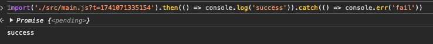
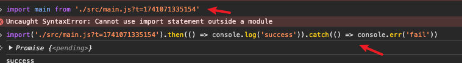
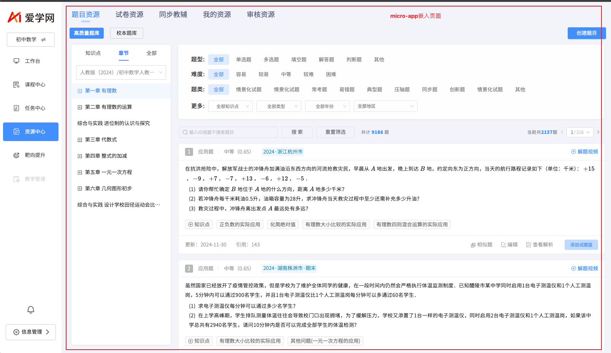
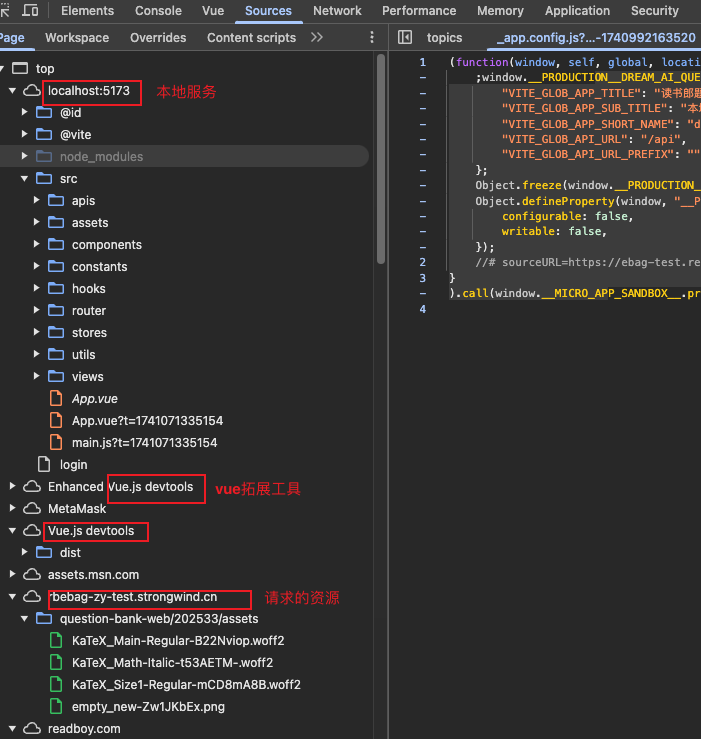
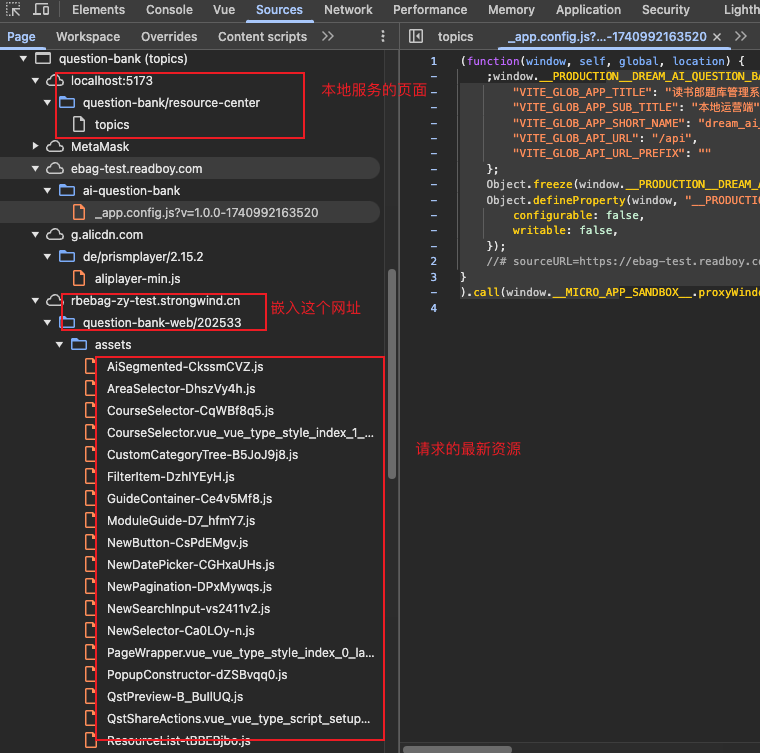
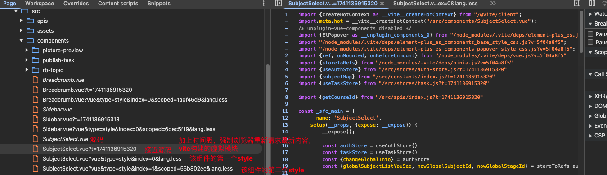

# vue

## 1、vite的热部署

### 1.1 知识补充

可以加载资源



import两种不同写法：

- import()

  动态导入资源，运行时执行，相对灵活

- import xx from './xx'

  静态导入资源，编译阶段时解析，对环境要求严格

  为什么需要在编译阶段解析？

  1. 文件之间依赖关系确定，提前确保在运行时不会错误
  2. 语法语义分析

浏览器加载本地服务资源



现代浏览器不支持es模块，但`某些现代浏览器和 Node.js 环境中，即使没有明确开启 ES 模块支持，也可以在特定情况下使用`

### 1.2 加载资源的写法

- 动态加载

  ```js
  // 示例：动态加载一个组件
  const module = await import('./MyComponent.vue');
  
  const routes = [
    {
      path: '/about',
      component: () => import('./views/About.vue'),
    },
  ];
  ```

- 静态加载

  ```js
  import xx from './xx'
  ```

### 1.3 如何实现动态加载


## 2、ref和reactive的区别


## 思考

### 1、什么是Native ESM？

原生 ECMA Module：原生es模式，js语言中一种原生、标准化的模块化机制

可以使用import、export实现变量函数导入导出

```html
<html lang="en">
<head>
    <meta charset="UTF-8">
    <title>Native ESM Example</title>
    <script type="module" src="./src/index.js"></script>
    <!-- script默认不使用module模式 -->
</head>
</html>
```

```javascript
// index.js
import { myFunction } from './utils.js';
myFunction();
```

```javascript
// util.js
export function myFunction() {
    console.log('This is a function from utils module');
}
```

### 2、为什么vue3+vite项目在开发时可以在浏览器中打开访问？

流程如下

当执行npm run dev时

1. 启动一个本地开发服务器

2. 使用原生es模块导入js

   浏览器可以通过import按需请求文件，vite服务器可以实时编译

   

3. 文件请求处理

   在浏览器中访问 `http://localhost:5173` 时，会发生以下过程

   1. 请求index.html
   2. 解析入口文件main.js
   3. 动态编译文件：.vue、.scss/.less、.ts
   4. 把编译后的文件通过http返回浏览器

4. 模块热更新：通过websocket实现

5. 请求借口

6. 浏览器兼容

简单来说：浏览器解析到入口文件main.js，根据main.js动态导入资源，资源包括各种各样的文件，vite去解析成浏览器可以识别再返回给浏览器。


### 4、衍生问题：怎么观察到vue是动态加载资源的？

- 在开发这工具中有sources/page：可以看见当前加载的文件内容

  当前页面

  

  页面资源显示

  

  

  

- 可以观察到当切换tab的时候会动态加载component、嵌入的网页的资源

- 开发环境加上时间戳让浏览器觉得这是一个新的文件，重新请求，获取最新资源


