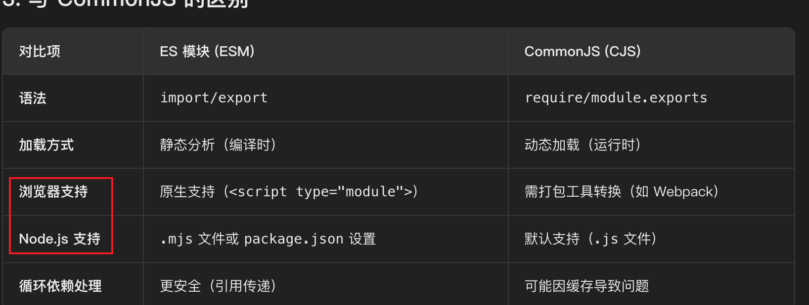

### 1. HMR

热模块替换：hot module replacement

是一种开发工具功能，允许在运行时**动态替换、添加或删除模块**，而**无需完全刷新页面**

```js
// vite.config.js
import vue from '@vitejs/plugin-vue';
export default { plugins: [vue()] };
```

<u>市面上常见的打包工具：vite、Webpack、Rollup</u>

`@vitejs/plugin-vue`

- vitejs

  `@vitejs` 是 Vite 官方团队的 npm 命名空间，（@vue是vue官方的命名空间）

- plugin-vue

  是vue的打包工具，`@vitejs/plugin-vue`是vite工具专门为vue设计的打包工具，兼容了vite的打包工具

vue的官方，vue2默认使用webpacl打包，vue3默认使用vite打包

### 2. JSX

在js中写html的代码，react的写法，下面例子是在vue3中使用

```jsx
// Component.jsx
export default {
  setup() {
    const count = ref(0);
    return () => <button onClick={() => count.value++}>{count.value}</button>;
  }
};
```

### 3. ESM

EcmaScript Modules

**ES 模块（ESM）** 是 JavaScript 的官方标准模块系统，用于在浏览器和 Node.js 中组织、封装和复用代码。


