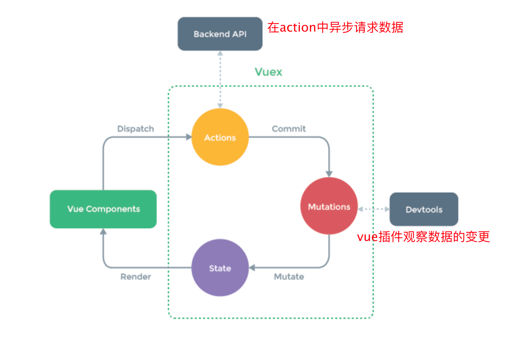

# vuex和pina的区别

带给你什么便利？

## 1、vuex

https://vuex.vuejs.org/zh/

四个核心要点



- 状态存储是响应式性的

- 约定中：

  1. 更新数据不能直接store.state.count = 1，唯一改变的方式是通过commit mutation方式，因为调试工具如：devtools，是通过追踪mutation数据改变，让开发者更好的调试。

  2. mutation的特征是同步性。如果mutation通过异步请求去更新state，这会让mutation失去同步性，异步去更新数据，调试工具难以准确的检测到

- vuex遵循单一的store集中管理状态

### 1-1 state

- 每个应用将仅仅包含一个 store 实例

- 如何获取state？

  使用mapstate做组件中的属性和store中的state的映射

  ```js
  // 在单独构建的版本中辅助函数为 Vuex.mapState
  import { mapState } from 'vuex'
  
  export default {
    // ...
    computed: mapState({
      // 箭头函数可使代码更简练
      count: state => state.count,
  
      // 传字符串参数 'count' 等同于 `state => state.count`
      countAlias: 'count',
  
      // 为了能够使用 `this` 获取局部状态，必须使用常规函数
      countPlusLocalState (state) {
        return state.count + this.localCount
      }
    })
  }
  // 或者直接this.$store.state.count去获取state中的数据
  ```

组件中可以直接拿到this.$store，vuex直接去全局注入这个对象

### 1-2 getter

- 获取state中派生状态

  ```js
  const store = createStore({
    state: {
      todos: [
        { id: 1, text: '...', done: true },
        { id: 2, text: '...', done: false }
      ]
    },
    getters: {
      doneTodos (state) {
        return state.todos.filter(todo => todo.done)
      }
    }
  })
  ```

- 如何调用？

  ```js
  // 直接获取
  this.$store.getter.doneTodos
  
  // 映射获取
  import { mapGetters } from 'vuex'
  export default {
    // ...
    computed: {
    // 使用对象展开运算符将 getter 混入 computed 对象中
      ...mapGetters([
        'doneTodosCount',
        'anotherGetter',
        // ...
      ])
    }
  }
  ```

### 1-3 mutation

- 唯一的改变state的方式，同步改变，这一特性可以被调试工具追踪到

  ```js
  // ...
  mutations: {
    increment (state, payload) {
      state.count += payload.amount
    }
  }
  
  store.commit('increment', {
    amount: 10
  })
  
  ```

- 组件中如何调用

  ```js
  // 直接调用
  this.$store.commit('increment')
  
  // 映射获取 
  mport { mapMutations } from 'vuex'
  
  export default {
    // ...
    methods: {
      ...mapMutations([
        'increment', // 将 `this.increment()` 映射成`this.$store.commit('increment')`
    }
  }
  ```

### 1-4 action

- 在action中异步获取请求，commit mutation去更新函数

  ```js
  const store = createStore({
    state: {
      count: 0
    },
    mutations: {
      increment (state) {
        state.count++
      }
    },
    actions: {
      increment (context) { // context是与store实例具有相同方法和属性
        context.commit('increment')
      }
    }
  }
  ```

- 组件中如何使用

  ```` js
  // 直接使用
  this.store.dispatch('increment')
  
  // 映射使用
  import { mapActions } from 'vuex'
  
  export default {
    // ...
    methods: {
      ...mapActions([
        'increment', // 将 `this.increment()` 映射为 `this.$store.dispatch('increment')`
  
        // `mapActions` 也支持载荷：
        'incrementBy' // 将 `this.incrementBy(amount)` 映射为 `this.$store.dispatch('incrementBy', amount)`
      ]),
      ...mapActions({
        add: 'increment' // 将 `this.add()` 映射为 `this.$store.dispatch('increment')`
      })
    }
  }
  ````

  所以，vuex中这三个核心，可以store中直接调用，也可以使用映射：

  mapState

  mapGetters

  mapMutation

  mapActions

### 1-5 module

- 由于使用单一状态树，应用的所有状态会集中到一个比较大的对象

​		为了解决以上问题，Vuex 允许我们将 store 分割成**模块**

```js
const moduleA = {
  state: () => ({ ... }),
  mutations: { ... },
  actions: { ... },
  getters: { ... }
}

const moduleB = {
  state: () => ({ ... }),
  mutations: { ... },
  actions: { ... }
}

const store = createStore({
  modules: {
    a: moduleA,
    b: moduleB
  }
})

store.state.a // -> moduleA 的状态
store.state.b // -> moduleB 的状态

```

- 模块内部也可以获取根节点的状态

  比如

  ```js=
  const moduleA = {
    // ...
    actions: {
      incrementIfOddOnRootSum ({ state, commit, rootState }) {
        if ((state.count + rootState.count) % 2 === 1) {
          commit('increment')
        }
      }
    }
  }
  ```

- 开启空间命名

  ```js
  // store/modules/user.js
  export default {
    namespaced: true,
    state: { userInfo: null, isAuth: false },
    mutations: {
      SET_USER(state, user) { state.userInfo = user; },
      SET_AUTH(state, isAuth) { state.isAuth = isAuth; }
    },
    actions: {
      async login({ commit }, credentials) {
        const user = await api.login(credentials);
        commit('SET_USER', user);
        commit('SET_AUTH', true);
      }
    },
    getters: { username: state => state.userInfo?.name }
  };
  
  // 组件使用
  methods: {
    ...mapActions('user', ['login']),
    ...mapGetters('user', ['username'])
  }
  
  this.$store.state.user.userInfo;  
  
  
  computed: {
    // 方法1：对象形式（可重命名属性）
    ...mapState('user', {
      userInfo: state => state.userInfo  // 映射为当前组件的 userInfo 计算属性
    }),
  ```

  

# 2、pina

https://pinia.vuejs.org/zh/

对比vuex

- 弃用mutation

- 弃用module，有多个实例

  pinia是多例的，使用扁平化store设计，

  stores之间是相互独立的，

- 使用的时候就想是一个全局对象去控制，而vux需要严格流程控制（action =》 mutation）

- 兼容ts

store是一个用reactive包装的对象

```js
const store = useCounterStore()
// 这里的store就是一个reactive
// 获取里面的数据就得用 store.count 才有响应式
// 如果想解构直接获取store里面的属性就用 storeToRefs
const { name, doubleCount } = storeToRefs(store)
```

三个核心：state、getter、action

# 3、vuex和pinia的区别

1、pinia取消了mutation，也就是直接更新state就行，就可以被调试工具检测到

2、pinia是多实例，可以使用defineStore创建多个store对象，而vuex是只使用module去区分模块

3、pinia是原生支持ts，vuex的话需要额外配置

4、vuex是基于vux2的object.defineProperty，pinia是基于vue3的响应式proxy

