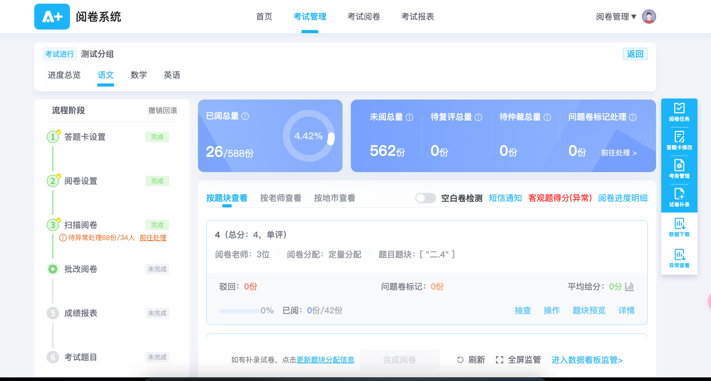
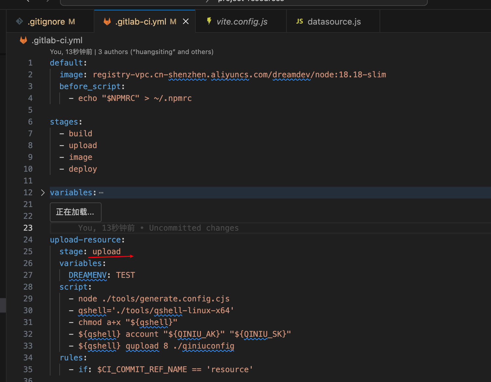
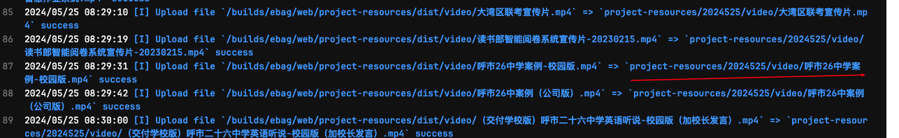

## 一、点阵笔项目

### 1、项目背景

上课教师可以使用的数智黑板项目。可针对数智作业下发的任务进行同步评讲，同步学生的答题情况。

### 2、负责功能

随堂测功能， 学生使用腾千里点阵笔在点阵纸上作答，web端同步学生笔迹，随堂测完成之后，教师可以对学生的作答进行批改。

### 3、技术难点

进入互动课堂就开始连接websocket-点击随堂测进入学生状态版-如果学生在线的话就可以点击进入查看

笔的状态会发送到后端-后端会实时同步到前端

- websocket同步，消息分类
- 使用腾千里sdk


## 二、大屏项目

参与项目数量3个

1. 阅卷系统统测数据看板大屏

   在线地址：https://ebag-test.readboy.com/unified-examination-display-board?exam_id=3556186340289530&subject_id=1

   项目地址：http://gitlab.dreamdev.cn/ebag/web/examination-system/unified-examination-display-board

2. 一体机项目

   在线地址：https://edu-test.readboy.com/project-resources/?productName=product-1

   项目地址：https://gitlab.dreamdev.cn/ebag/web/project-resources

3. 区域智慧作业监管大屏

   在线地址：https://ebag-test.readboy.com/homework-data-screen/main-screen

   项目地址：https://gitlab.dreamdev.cn/ebag/web/homework-system/data-screen

### 1、大屏通用问题

#### 1.1、自适应问题

- 使用postcss-pxtorem将px转成rem，postcss.config.js 将代码中定义的px数字转成rem，

  ```js
  // 假如是设置font-size:50px，那么转成rem就是3.125rem
  module.exports = {
    plugins: {
      'postcss-pxtorem': {
        rootValue: 16,
      }
    }
  }
  // rem就当作是浏览器默认字体大小，通过改变浏览器字体大小来改变显示的大小
  ```

- rem.js 更改根字体大小，

  ```js
  // 配置基本大小
  let baseSize = 16
  // 设置 rem 函数
  function setRem() {
    //当前页面宽度相对于1920px屏幕宽的缩放比例，可根据自己需要修改。
    let scale = document.documentElement.clientWidth / 1920
    document.documentElement.style.fontSize = baseSize * Math.min(scale, 2) + 'px'
    
  }
  setRem() //初始化
  
  window.onresize = function () {
    setRem()
  }
  // 假设浏览器的根字体大小被设置成17px，那么3.125rem就是3.125*17=21.875px，被放大了
  ```


### 2、阅卷系统统测数据看板大屏

- 查看地址：https://ebag-test.readboy.com/examination-web/#/Login  15844444444  24**rb

- 选择进入联考管理
- 选择考试管理-选择科目-点击跳转数据看板监测
- 点击进入数据看板监测



#### 2.1 项目背景

多校、多个科目的联考进入批改阅卷阶段产生数据的大屏显示

#### 2.2 技术难点

- 传送消息：路由传递考试的id，科目id，用户信息比较隐私的使用postmesssage发送

- js实现无限向上滚动

  虚拟列表：在父元素盒子拼接两个列表，当盒子的滚动长度大于列表长度让盒子重新滚动

  ```js
  function rollStart(t) {
    if (!show2.value) return
    let ul1 = document.getElementById('comment1')
    let ulbox = document.getElementById('review_box')
    rollStop()
    timer = setInterval(() => {
      // 当滚动高度大于列表内容高度时恢复为0
      if (ulbox.scrollTop >= ul1.scrollHeight) {
        ulbox.scrollTop = 0
      } else {
        ulbox.scrollTop += 1
      }
    }, t)
  }
  
  ```

- 使用echart实现地图效果

###  3、一体机项目

#### 3.1、项目背景

展厅展示公司六个核心项目，产品介绍、产品介绍、产品相关文档、产品页面跳转

#### 3.2、技术难点

- 视频文件太大，如果放在项目中去加载会耗费很多时间，所以在项目中切出一个分支专门处理上传资源到cdn，ci文件只写一个upload阶段

  

  cdn的文件地址

  

  公司的cdn地址

  

  弊端：当视频文件改变的时候需要重新更新，访问地址也需要更新，最好的做法是有接口返回最新视频地址，让后端更新视频

### 4、区域智慧作业监管大屏

#### 4.1 项目背景

给教育局看的数智作业产生数据的大屏

https://ebag-test.readboy.com/smart-homework/home 15625390666 123456 区域管理员账号 作业监督->大数据看板

#### 4.2 技术难点

- 使用echart绘制图表


