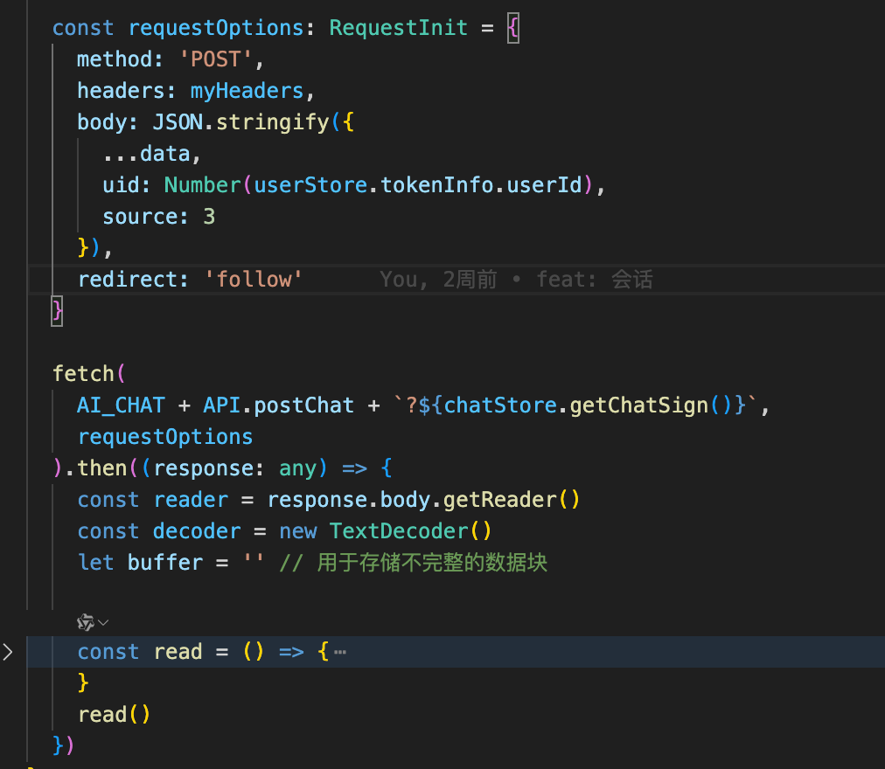

## 1、axios在浏览器中不支持流式返回

### 1.1 项目的需求和解决

**需求背景：**接入ai聊天界面，数学学科根据需求是需要使用deepseek进行深度思考，深度思考时间大致在二三十秒，所以采取的是流式返回数据，实时显示dp返回的数据

**问题：**项目中使用axios请求接口，axios是基于xhr请求的，在浏览器中是不支持流失返回，都是获取所有的数据后才会全部返回

解决：使用fetch去请求接口，在then中去解码数据，具体实现代码



### 1.2 背后的知识点

#### 1、xhr和fetch的区别

写法上

```js
// 根据返回状态码status去处理数据
const xhr = new XMLHttpRequest();
xhr.open('GET', 'https://api.example.com/data', true);
xhr.onreadystatechange = function() {
  if (xhr.readyState === 4 && xhr.status === 200) {
    console.log(xhr.responseText);
  }
};
xhr.send();


// 支持链式的async/await语法，处理完可以再去处理
fetch('https://api.example.com/data')
  .then(response => response.json())
  .then(data => console.log(data))
  .catch(error => console.error(error));
```

数据流与性能

1. xhr是一次性加载到内存中，不支持分块处理，大文件请求会占用资源

2. fetch支持stream api，可以逐块读取数据，适用于大文件下载或实时流处理

   ```js
   const reader = response.body.getReader();
   while (true) {
     const { done, value } = await reader.read();
     if (done) break;
     console.log(value);
   }
   ```

#### 2、扩展：大文件下载的实现方式

1. fetch

   原理：前端指定下载大小，分块下载文件数据，接口需要告知文件大小等信息

   ```js
   async function downloadLargeFile(url, fileName) {
     const CHUNK_SIZE = 10 * 1024 * 1024; // 10MB
     let offset = 0;
     const fileStream = [];
     
     // 获取文件总大小
     const headResponse = await fetch(url, { method: 'HEAD' });
     const fileSize = parseInt(headResponse.headers.get('Content-Length'));
     
     while (offset < fileSize) {
       const end = Math.min(offset + CHUNK_SIZE, fileSize);
       const response = await fetch(url, {
         headers: { Range: `bytes=${offset}-${end - 1}` }
       });
       const blob = await response.blob();
       fileStream.push(blob);
       offset = end;
     }
     
     // 合并分片并触发下载
     const mergedBlob = new Blob(fileStream);
     const downloadUrl = URL.createObjectURL(mergedBlob);
     const a = document.createElement('a');
     a.href = downloadUrl;
     a.download = fileName;
     a.click();
     URL.revokeObjectURL(downloadUrl);
   }
   ```

2. fetch+blob获取文件的二进制流 

   但是获取的是整个文件的二进制流，太大的文件也会导致内存溢出，适合小体积文件

   ```js
   fetch('https://example.com/file')
     .then(response => response.blob()) // 将整个响应体转为Blob
     .then(blob => {
       const url = URL.createObjectURL(blob);
       const a = document.createElement('a');
       a.href = url;
       a.download = 'filename.ext';
       a.click();
       URL.revokeObjectURL(url); // 释放内存
     });
   ```

   可以使用流式

   ```js
   const reader = response.body.getReader();
   let chunks = [];
   
   while (true) {
     const { done, value } = await reader.read();
     if (done) break;
     chunks.push(value); // 分块存储
   }
   
   const blob = new Blob(chunks); // 最终合并
   ```

3. 断点续传/分片上传