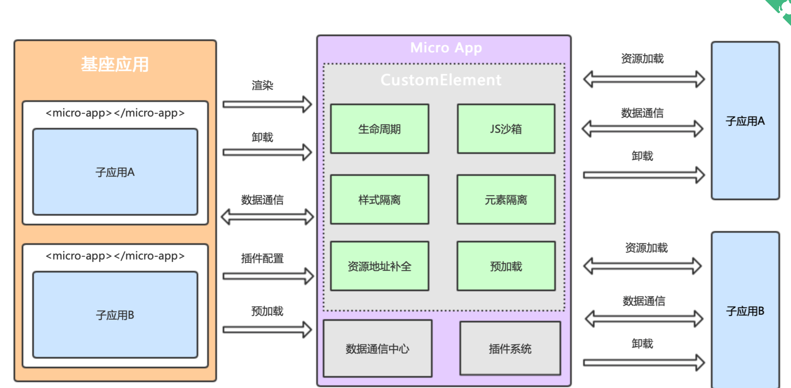
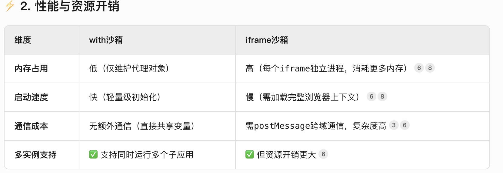

# micro-app

https://cangdu.org/micro-app/docs.html#/

## 1、什么是micro-app



### 1-1 生命周期


- 

## 2、隔离机制

### 2-1 js沙箱

#### 1、 子应用中去访问window会不会获取到的是主应用的window？

不会，有沙箱隔离机制，且有两种机制

#### 2、两种沙箱机制，with沙箱和iframe沙箱

- with沙箱

  micro-app通过proxy为每一个子应用创建一个fakewindow对象（即沙箱环境）

  子应用都被包裹在沙箱环境中，对所有的window操作都会重定向到自己的fakewindow代理对象中

  ```js
  // 简化版 Proxy 沙箱实现
  const rawWindow = window;
  const fakeWindow = {};
  const proxy = new Proxy(fakeWindow, {
    get(target, key) {
      return target[key] || rawWindow[key]; // 优先读沙箱，不存在则读全局
    },
    set(target, key, value) {
      target[key] = value; // 仅写入沙箱，不污染全局
      return true;
    }
  });
  ```

  子应用通过**`window.rawWindow`**获取主应用的window

  逻辑隔离

  

- iframe沙箱

  利用浏览器原生的<iframe>标签创建物理隔离的独立上下文，子应用拥有独立的window、document和全局对象



#### 3、vite得使用iframe沙箱才能正常渲染

Vite 作为子应用在 MicroApp 中默认无法直接加载，需切换为 `iframe` 沙箱模式才能正常运行，这是由 **Vite 的开发模式特性**与 **MicroApp 的默认沙箱机制冲突**导致的。

### 2-2样式隔离

主应用给每一个子应用标记name，就会利用这个name属性给每一个样式前添加前缀

```css
.test {
  color: red;
}

/* 转换为 */
micro-app[name=xxx] .test {
  color: red;
}
```

在这种条件下，主应用的样式也会对子应用造成样式污染

```css
// 主应用 
button { color: red;}

// 如果子应用没有对这个button的标签选择器进行重写的话，就会样式污染。可以在子应用的界面下重写button样式
<micro-app
  v-if="initStatus"
  name="question-bank"
  iframe
/>

<style lang="less" scoped>
  micro-app {
    height: 100%;

    button {
      color: unset;
    }
  }
}
</style>

```

### 2-3 元素隔离

当主应用和子应用同时拥有`<div id='root'></div>`，子应用使用document.querySelector('#root')获取到的是自己的div

主应用可以获取子应用的元素，没有对基座应用操作子应用元素的行为进行限制。

但是，不能通过全局性的东西进行访问，还是处于隔离的状态

```js
// 无效操作：无法获取子应用内部的 #child-element
document.querySelector('#child-element'); // 返回 null
```

主应用获取子应用元素的方案

```js
// 1、通过micro-app的api，microApp.getElements

// 获取子应用 "child-app" 的所有元素
const childElements = microApp.getElements('child-app');

// 示例：查找特定按钮
const submitBtn = childElements.querySelector('#submit-btn');
submitBtn.addEventListener('click', () => {
  console.log('子应用按钮被点击');
});


// 2、通过通信子应用主动将元素暴露出去
// 子应用
window.microApp.dispatch({
  type: 'EXPORT_ELEMENT', payload: domRef.value
})
// 主应用
microApp.addDataListener('child-app', (data) => {
  if (data.type === 'EXPORT_ELEMENT') {
    const elementRef = data.payload;
    elementRef.style.border = '2px solid red'; // 操作元素
  }
})

```


## 3、如何通信

#### 父->子	

```js
// 父传
// 1
<template>
  <micro-app
    name='my-app'
    url='xx'
    :data='dataForChild' // data只接受对象类型，数据变化时会重新发送
  />
</template>
// 2 手动传
import microApp from '@micro-zoe/micro-app'

// 发送数据给子应用 my-app，setData第二个参数只接受对象类型
microApp.setData('my-app', {type: '新的数据'})


// 子获取
// 1
const data = window.microApp.getData() // 返回基座下发的data数据

// 2 手动监听获取
function dataListener (data) {
  console.log('来自基座应用的数据', data)
}
window.microApp.addDataListener(dataListener: Function, autoTrigger?: boolean)
```

#### 子->父

```js
// 子发送
window.microApp.dispatch({type: '子应用发送的数据'})

// 父接收
// 1
import microApp from '@micro-zoe/micro-app'
const childData = microApp.getData(appName) // 返回子应用的data数据

// 2 监听datachnge
<template>
  <micro-app
    name='my-app'
    url='xx'
    // 数据在事件对象的detail.data字段中，子应用每次发送数据都会触发datachange
    @datachange='handleDataChange'
  />
</template>

// 3
microApp.addDataListener(appName: string, dataListener: Function, autoTrigger?: boolean)
```

#### 全局通信

## 4、预加载

可以在main.js中调用preFetchApps调用预加载子应用

```js
// 主应用入口文件（main.js 或 micro-app-config.js）
import microApp from '@micro-zoe/micro-app';

microApp.start({
  preFetchApps: [ // 预加载子应用列表
    { 
      name: 'child-app', 
      url: 'http://localhost:3001',
      disableSandbox: true, // 关闭沙箱（Vite子应用需关闭）[6,7](@ref)
      isPrefetch: true, // 标记为预加载
    },
  ],
});
```

