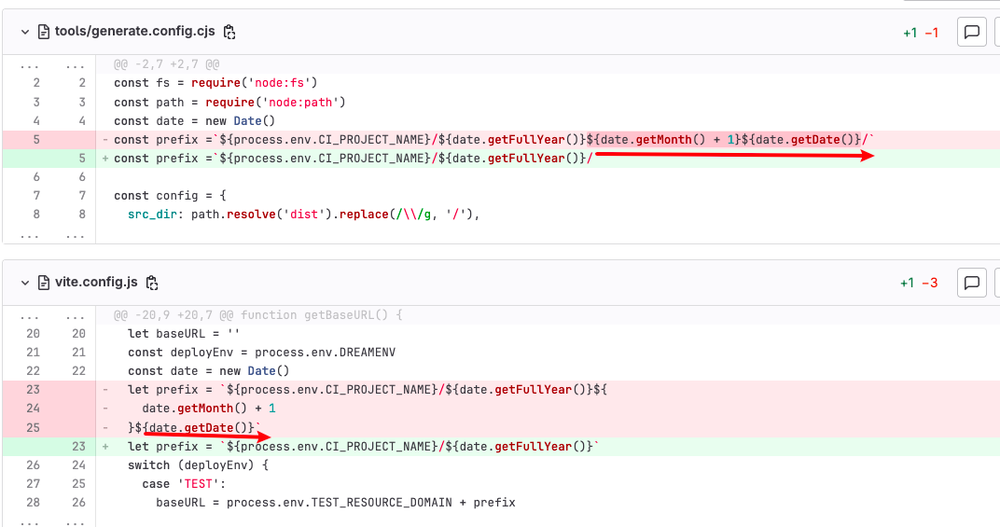
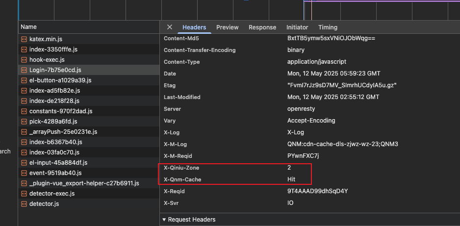
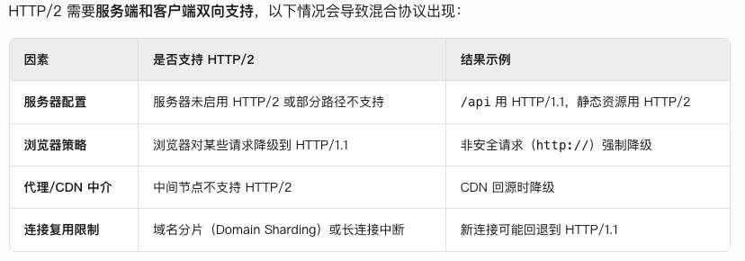

## 1、请求资源优化

### 1-0 实践

tools/generate.config.cjs：资源上传到bucket路径

vite.config.js：vite项目请求资源路径



原来的资源保存在bucket中的 `项目/年/月/日/下`，现在改成 `项目/年`

vite打包资源，只有在文件内容改变的时候才会生成新的文件名，访问的时候才会请求新的资源

- 每次请求资源 源站 =》 cdn节点 =》浏览器缓存

- 这样可以提高资源的命中率，减少资源请求的时间

### 1-1知识点：查看资源是否命中源站或者cdn节点

公司资源上传到七牛云



x-qnm-cache的值

- **`Hit`**
  表示请求的资源已存在于CDN节点缓存中，直接由边缘节点响应，无需回源（如中的`X-Qnm-Cache: Hit`）。
- **`Miss`**
  表示CDN节点未缓存该资源，需向源站拉取数据并可能更新缓存（如中的`X-Qnm-Cache: Miss`）。

### 1-2 发现的问题：爱学网手机端ai-learn-mobile-student这个项目，打包后dist每一次的hash会变化，更新到七牛云每一次的资源都是变化的

## 2、项目优化

css、js、pretter

变成优化

各种lint

## 3、针对vue的性能优化

### 1、数据上

1. 对于组件数据结构的设计，结合开发场景，选择合适的数据结构，使用对象还是数组，减少底层的计算和内存消耗。
2. 结合conputed和watch这两个，避免在模版中使用复杂的逻辑计算

### 2、组件上

1. 设计通用型、可扩展组件，提高组件的复用率，以减少组件的数量和引用打包成本。

2. 对于一些频繁切换的组件，使用keep-alive缓存，让组件不会被销毁

   ```vue
   <router-view v-slot="{ Component }">
     <transition>
       <keep-alive>
         <component :is="Component" />
       </keep-alive>
     </transition>
   </router-view>
   ```

   涉及到的生命周期是：`activated`和`deactivated`

   在切换组件时，当前组件时deactivated，组件的整个对象都会被缓存起来；在切换回来的时候，触发activated，缓存的东西又被拿回来使用。如果使用v-if的话，整个组件就会被不断的卸载和创建。


### 3、组件懒加载

组件在首次使用的时候才会被引入加载，不会被打包进index.js，以减少首次打开网站的资源加载时间

### 4、虚拟dom优化

使用key值，在更新数据的时候不会更新整个dom树，而是diff算法根据这个key去计算出更新的节点去更新，减少回流成本

### 5、资源优化

使用**`vite-plugin-imagemin`**插件压缩图片，根据配置在一定程度上会使图片失真

图片懒加载：使用v-lazy指令，`vue-lazyload`

## 4、一般的性能优化手段

### 1、资源加载性能优化

#### 1-1、vite集成tree shaking

开发是不用使用rollup打包的，因为浏览器已经可以识别esm模块

Vite 直接调用 Rollup 进行打包，可以通过esm的import和export模块，移除未被使用的代码

#### 1-2、图片优化

- 图片懒加载：延迟加载非视口内的图片，只有用户滚动到附近的时候才会开始加载

  ​	原生

  ```html
  
  ```

  ​	js实现

  ```			html
  
  ```

  ```js
  document.addEventListener("DOMContentLoaded", () => {
    const lazyImages = document.querySelectorAll("img.lazy");
  
    const observer = new IntersectionObserver((entries) => {
      entries.forEach((entry) => {
        if (entry.isIntersecting) {
          const img = entry.target;
          img.src = img.dataset.src; // 替换为真实图片
          img.classList.remove("lazy");
          observer.unobserve(img); // 停止监听已加载的图片
        }
      });
    });
  
    lazyImages.forEach((img) => observer.observe(img));
  });
  ```

- 使用插件压缩图片，在构建的时候去压缩图片

### 2、减少http请求

#### 2-1 小图标使用雪碧图，通过定位方式截取图片

#### 2-2 内联的一些资源（css/js）写到html中 =》 index.html

#### 2-3 使用http2:支持多路复用，减少连接开销



### 3、缓存优化

- 强缓存：`max-age=31536000`（1 年）静态资源。
- cdn加速

### 4、渲染性能优化

- 减少重绘/重排

- 长列表进行虚拟化滚动

   第三方库的使用：vue-virtual-scroller

- 减少主进程负担

  复杂计算使用web worker

​		
