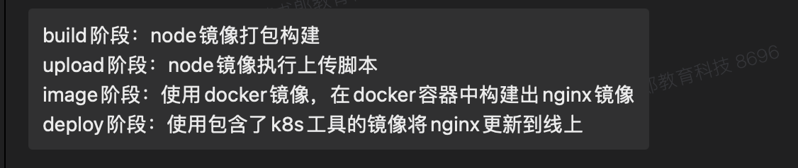

# CI/CD

gitlab的ci文档https://docs.gitlab.com/ci/

## 1、什么是CI/CD

自动化管理项目、部署项目的工具

### 1.1 CI：continuous integration 持续集成

每次提交到主分支自动触发构建和测试，保证代码的兼容性和正确性。

具体步骤如下：

1. 代码提交：代码推送到版本控制系统（如git）
2. 自动构建：系统自动编译代码并生成可执行文件
3. 自动测试：运行单元测试、集成测试等
4. 反馈：测试结果

### 1.2 CD：continuous delivery 持续交付 / continuous deployment 持续部署

1. 持续交付：在 CI 基础上，确保代码**随时可手动发布到生产环境**
2. 持续部署：自动将代码部署到生产环境

### 1.3 流程

代码提交 》》自动构建 》》自动化测试 》》生成可部署包 》》部署到生产环境

------------------ci持续集成------------｜---cd持续交付--｜---cd持续部署---

## 2、项目部署的几种方法

### 2.1 传统服务器部署

1. 本地生成的dist产物
2. 将构建文件上传到服务器
3. 配置web服务器指向静态文件目录

### 2.2 自动化部署工具（CI/CD）

最简单的🌰：

1. 代码上传到gitlab
2. gitlab构建项目产物
3. 产物上传到服务器（当然服务器要配置好项目环境）
4. 自动生效

### 2.3 容器化部署（docker）

1. 编写dockerfile，定义node和nginx环境

   ```
   # 使用 Node.js 镜像构建项目
   FROM node:18 as builder
   WORKDIR /app
   COPY package*.json ./
   RUN npm install
   COPY . .
   RUN npm run build
   
   # 使用 Nginx 镜像托管静态文件
   FROM nginx:alpine
   COPY --from=builder /app/dist /usr/share/nginx/html
   EXPOSE 80
   CMD ["nginx", "-g", "daemon off;"]
   ```

2. 构建镜像并推送到镜像仓库（公司用的是gitlab的镜像仓库）

   ```
   docker build -t my-frontend-app:latest .
   
   推送到阿里云镜像
   docker tag my-frontend-app:latest registry.cn-hangzhou.aliyuncs.com/your-namespace/my-frontend-app:latest
   docker push registry.cn-hangzhou.aliyuncs.com/your-namespace/my-frontend-app:latest
   ```

   结合ci文件配置，可以省去手动过程

   ```
   build-and-push:
     stage: deploy
     script:
       - docker build -t my-frontend-app:latest .
       - docker push username/my-frontend-app:latest
   ```

3. 在服务器拉取最新镜像并部署容器，就可以访问

   ```
   # 拉取镜像（如果已推送）
   docker pull username/my-frontend-app:latest
   
   # 运行容器
   docker run -d -p 80:80 --name my-app my-frontend-app:latest
   ```

### 2.4 静态托管与CDN服务

无需管理服务器，直接托管静态文件并加速访问。

公司项目资源上传到七牛云，可以直接访问bucket中的资源

https://rbebag-zy-test.strongwind.cn/ai-learn-pc/2025219/index.html


发现的现象：

1. 在相同浏览器打开这个网页的时候，可以正常请求资源，在不刷新页面的情况下，可以正常点击，跳转页面

2. 刷新页面之后，会报这个错误

   

3. 进入到这个index.htmlvue应用会根据createWebHistory转向登陆页面

这个项目中使用的是`createWebHistory`模式，七牛云服务器中只有静态资源，没有nginx服务器，nginx在这里主要用于将vue项目的请求转向index.html文件

- 首次访问的时候
  1. 浏览器访问上面的这个url，就向七牛云服务器发送请求，返回这个index.html
  2. 根据这个index.html去解析js、html、css，加载这个vue应用，也包含了这个路由配置，即客户端的路由配置
  3. 加载完之后，根据createWebHistory配置去匹配路由规则，这样能够正常访问
- 刷新当前页面
  1. 再次请求的时候，浏览器发送的是一个http请求，七牛云服务器会根据url去找对应的资源
  2. 找不到就会报错，vue应用无法正常加载

### 2.5 平台化部署

结合多种方式进行部署

1. 选择平台：公司用的是阿里云
2. 配置项目：dockerfile
3. 自动部署：ci+gitlab+生成镜像
4. ci的deploy阶段让阿里云去拉取镜像部署



## 3、SSH

连接远程服务器有两种协议：https和ssh

### 3.1 什么是ssh

SSH：Secure Shell，是一种用于安全远程访问和管理计算机的网络协议，在传输的过程中，通过**加密技术保护数据传输**，**防止敏感信息在传输过程中被窃听或篡改**。

相当于，**本地系统连接远程服务器，然后去操作远程服务器**。

git中，ssh主要用于安全地连接远程代码仓库，通过ssh密钥认证完后：

- 免密码pull/push代码

- 提高安全性（避免明文传输）

- 管理多账户

  本地系统生成了一对密钥，用户公司的仓库用的是gitlab，个人账户用的是gitub，可以用同一个公钥配置在gitlab和gitub中

### 3.2 ssh的工作原理

### 3.3 如何在gitlab中配置

- 生成ssh密钥

  ```
  ssh-keygen -t rsa -C "your_email@example.com"
  ```

  -t：指定密钥类型，rsa、Ed25519

  -C：在gitlab中配置的邮箱

- 在存储的文件夹中会有这几个文件

  在根目录的ssh文件夹中，命令 ～/.ssh

  

  将公钥配置到gitlab中就可以配置完成了

  

  如果是服务端，这里会有另一个文件，authorized_keys，用来存放连接客户端的公钥

- 生成的ssh密钥

  私钥文件id_rsa：私钥文件，包含身份验证的敏感信息

  公钥文件id_rsa.pub：公钥文件，可以分享给需要验证你身份的服务器或平台

  known_hosts：是ssh客户端用户存储**已连接过的远程主机的身份信息**

  1. 当首次使用ssh连接一个远程主机时，ssh会获取远程主机的公钥，客户端会保存这个公钥到自己的konwn_hosts文件中
  2. 后续再连接同一主机时，客户端就会将新获取的主机公钥匙与`known_hosts` 文件中存储的公钥进行比对
  3. 如果两者匹配，则认为连接是安全的；如果不匹配，客户端会发出警告，提示你可能存在安全风险，因为这可能意味着主机的身份发生了变化或者存在中间人攻击

  

### 3.3 公钥和私钥

是基于非对称加密算法生成的一对密钥

- 公钥加密的数据只能用对应的私钥解密
- 用私钥加密的数据（实际更多用于签名）只能用对应的公钥解密验证

使用场景：

- 数据加密传输：获取对方服务器保护的数据

  

- 数字签名：验证数据的来源和完整性

  

- **`身份验证：SSH身份验证`**

  

### 3.4 连接远程服务器的两种协议

#### 1、https协议

首次访gitlab的时候输入用户名和Personal Access Token

#### 2、ssh协议

1. 用户执行`git clone`命令，客户端尝试ssh连接到gitlab服务器

2. 服务器验证客户端身份

   用ssh的身份认证机制，gitlab发送随机数据给客户端，客户端用私钥签名随机数据，发送给gitlab，gitlab用客户端的公钥解密，如果是这个随机数据，则身份验证成功。

3. **建立安全连接**：
   验证通过后，客户端与服务器之间建立加密的 SSH 连接，用户可以执行 Git 操作

## 4、核心概念

job >> stage >> pipeline


### 4.1 job（任务）：任务是流水线的最小执行单元，定义了具体的操作（如运行脚本、编译代码、执行测试）

每一个job必须属于某一个stage

### 4.2 stage（阶段）：阶段是流水线中的逻辑分组，例如 `build`、`test`、`deploy`

一个stage可以包含多个job，同一个stage里面的job是并行的，不同stage的job是串行的

一个stage执行完后才能执行下一个stage

举个🌰

```
// 有三个stage：build、test、deploy三个阶段
// 三个任务：build_job（属于build阶段）、test_job（属于test阶段）、deploy_job（属于deploy阶段）

stages:
  - build
  - test
  - deploy

build_job:
  stage: build
  script:
    - echo "Building the project..."
    - make build

test_job:
  stage: test
  script:
    - echo "Running tests..."
    - make test

deploy_job:
  stage: deploy
  script:
    - echo "Deploying the project..."
    - make deploy
  only:
    - main
```

### 4.3 Pipeline（流水线）：由一系列的stage和job构成

### 4.4 runner（执行器）：是一个用于执行 CI/CD 流水线中 job 的应用程序

#### 4.4.1 runner的作用

1. 执行job
2. 为job提供执行环境（虚拟机、docker容器等）
3. 分布式执行：并行执行job

公司使用的是gitlab社区版，有个ci服务器，这个ci服务器专门跑这个runner，job的整个流程在runner运行

#### 4.4.2 补充知识点

`可以先看下第5点认识下gitlab`

公司的gitlab计划版本


#### 4.4.3 runner分类


- gitlab.com版本的shared runner由官网提供，自己也可以配置specific runner和group runner

- 自托管版本的都需要自己配置

#### 4.4.4 公司的runner

在公司的项目中或者群组里面都找不到runner的配置，使用的是免费版？奶奶的，是我没有权限！！

要到了两个小时的权限，嘻嘻

公司的runner状态


#39是公司项目的公用runner


#### 事故！！

有一次公司的ci跑不了了，就是这个服务器的runner资源不够了，要拓展。

### 4.5 .gitlab-ci.ym文件

编写一个可以执行的ci文件，一个ci文件由下列四个构成，都是为job提供配置

- stages：阶段

  ```
  stages:
    - build
    - test
    - deploy
  ```

- job

  ```yaml
  job2:	// job的名称，可以自定义
  	stage: build // job对应的stage阶段
    script:	// 要执行的脚本命令
      - echo "This is job 2"
      - npm install
      - npm test
  ```

- variable：变量

  ```
  variables:
    APP_NAME: "my_app"
    NODE_VERSION: "14"
  ```

- default：默认job的定义

  ```
  default:
    image: node:14   使用node14的node镜像
    tags:
      - docker			 使用标签为docker和linux的runner
      - linux
  ```

一般来说stages的常见阶段：build、test、deploy、review、package、upload、image、或者自定义

关键语法元素可以自行搜索

```
job:
	stage: build 		****1job对应的stage阶段
	
	
	rules: 					****2 用于控制 `job` 的执行条件，可根据不同的条件决定是否执行某个 `job`
    - if: '$CI_COMMIT_BRANCH == "main"'
      when: always // 总是执行
    - if: '$CI_MERGE_REQUEST_ID'
      when: manual // 手动触发执行
      
 
  cache: 					****3 用于缓存
    paths:
      - node_modules/ 
      
      
  artifacts:      ****4 将dist/文件下存为制品 
    paths:
      - dist/
      
      
  script:					****5 执行的脚本命令
    - npm install
    - npm run build
```

## 5、gitlab

分类总结图


gitlab有两种版本：

- GitLab SaaS 服务（GitLab.com）：直接网站访问，由 GitLab 官方托管，用户无需管理基础设施。

  有三种计划，每种版本中又有社区版和企业版

  

- **自托管 GitLab**：用户在自己的服务器或云环境中部署

  公司使用的是`自托管gitlab`

  

  使用方便好记的域名：https://gitlab.dreamdev.cn/

## 6、gitlab ci/cd的工作过程

1. 代码推送

2. 触发流水线

   gitlab监测到代码变更，根据.gitlab-ci.yml文件触发流水线

3. 执行任务

   runner按照流水线配置执行任务，如构建、测试、部署

4. 生成报告

   完成任务后生成测试报告，每个任务都有一个报告

5. 部署

   如果所有任务成功，代码会自动或手动部署到目标环境

## 思考

### 1、deploy阶段跟gitlab和阿里云服务器的关系

在deploy阶段将产物上传到七牛云，阿里云配置这个地址？阿里云的如何拉取部署？

爱学网有两个访问域名

https://ebag-test.readboy.com/ai-learn-pc/index/workbench#/

https://aixue.readboy.com/ai-learn-pc/login

看下是否是阿里云配置了两个域名

访问bucket中的资源也可以访问：https://rbebag-zy-test.strongwind.cn/ai-learn-pc/index/assignment

### 2、upload上传资源到七牛云的阶段？

加载七牛云的配置文件


### 3、操作一下使用ci部署一套全流程可以访问网站

。。。哈哈哈

实战转到《部署一套gitlab实现ci流水线.md》

### 4、什么是gitlab实例？

是在特定环境中部署和运行的一个独立的gitlab服务系统

`GitLab 是一个基于 Web 的 Git 仓库管理工具，提供了代码托管、版本控制、项目管理、持续集成与持续部署（CI/CD）等一系列功能。而 GitLab 实例就是这个工具在具体环境中的实际运行体，它就像是一个独立的软件副本，拥有自己的配置、数据和用户群体。`

部署形式：

1. 自托管实例：公司自己搭建和管理gitlab服务器
2. 云托管实例：简单说就是由官方自己的提供的服务器，在gitlab.com可以直接操作

### 5、练习：分析下公司的gitlab-ci.yml文件

`在同目录文件下：分析一个具体生产环境下gitlab-ci.yml文件.md`
