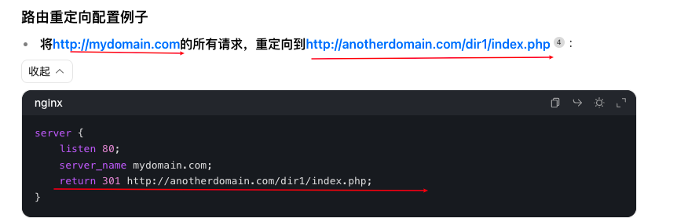

# Nginx-上

## 1、什么是服务器

为其他设备或程序**提供服务**的计算机或软件系统，例如**存储数据、托管网站、运行应用程序、处理网络请求**等

- 按硬件分

  **物理服务器**：

  ​	一台实际的计算机设备，有高性能CPU，大容量内存和硬盘（例如：企业内部的服务器、云服务提供商的物理机器）

  **虚拟服务器**：

  ​	通过虚拟化技术在物理服务器上创建 多个虚拟服务器（例如：VMware、VirtualBox 创建的虚拟机。）

  **云服务器**：

  ​	基于云计算技术提供的虚拟服务器，用户可以动态调取资源（如 CPU、内存、存储）（例如：AWS EC2、阿里云 ECS、腾讯云 CVM）

- 按软件分

  **web服务器**：

  <!-- ​	[托管网站和应用程序，处理http请求]()（例如：nginx、apache） -->

  数据库服务器：

  ​	存储和管理数据，提供数据查询和操作服务（例如：MySQL、PostgreSQL、MongoDB）

  **文件服务器**：

  ​	提供文件存储和共享服务（例如：FTP 服务器）

  **应用服务器**：

  ​	运行业务逻辑和应用程（例如：Tomcat（Java）、Node.js、Django）

## 2、思考

### 2.1 一台服务器上可以运行很多服务器？

可以，下面是个部署到服务器的前后端分离项目，至少有5个服务器。通过第1点的解释，其实对服务器的定义是很宽泛的，只要能对客户端提供服务的就是服务器。


### 2.2 使用vue3+vite开发的项目，本地可以直接访问，是谁作为服务器的角色？

vite作为一个开发服务器的角色，直接托管前端文件，vue项目中配置端口号，浏览器可以直接访问

- 进一步问：nodejs的角色是什么？

  nodejs提供js运行环境，vite提供开发服务器和构建项目功能

## 3、从前端的角度理解nginx

### 3.1 作为静态资源服务器

Nginx 可以作为静态资源服务器，直接托管前端项目中的 HTML、CSS、JavaScript、图片、字体等文件。

- 快速响应对静态资源的请求。
- 支持浏览器缓存（通过配置缓存策略），减少重复请求，提升页面加载速度。

当浏览器第一次访问静态资源后，如果配置正确，浏览器在第一次请求资源后，后续请求会直接从浏览器缓存中加载资源，而不会再次向 Nginx 服务器请求。这是通过 **HTTP 缓存机制** 实现的。

关于缓存有两种实现方式：http设置缓存、nginx缓存

- http缓存是通过HTTP协议响应头字段来控制

  比如nginx返回静态资源时，可以在响应头添加字段：**`Cache-Control`** **`Expires`** **`ETag`**

- ##### nginx缓存

  1. 浏览器缓存：设置请求响应头来控制浏览器的缓存行为

     ```xml
     location ~* \.(js|css|png|jpg|jpeg|gif|ico|svg|woff|woff2|ttf|eot)$ {
         expires 1y; # 设置缓存时间为 1 年
         add_header Cache-Control "public, max-age=31536000"; # 设置 Cache-Control
     ```

  2. nginx服务器缓存

     将资源缓存在服务器端，减少对后端的请求

     nginx可以对静态资源缓存，也可以对请求进行缓存

     ```
     # 定义缓存路径和参数
     proxy_cache_path /var/cache/nginx levels=1:2 keys_zone=my_cache:10m max_size=1g inactive=60m use_temp_path=off;
     
     server {
         listen 80;
         server_name example.com;
     
     		// 缓存接口
         location /api/ {
             proxy_cache my_cache; # 启用缓存
             proxy_pass http://backend; # 转发请求到后端服务器
             proxy_cache_valid 200 302 10m; # 缓存 200 和 302 响应 10 分钟
             proxy_cache_valid 404 1m; # 缓存 404 响应 1 分钟
             add_header X-Cache-Status $upstream_cache_status; # 添加自定义头，显示缓存状态
         }
     
     		// 缓存资源
     		location / {
             root /path/to/your/vue3/dist;
             index index.html;
     
             # 静态资源缓存 1 年
             location ~* \.(js|css|png|jpg|jpeg|gif|ico|svg|woff|woff2|ttf|eot)$ {
                 expires 1y;
                 add_header Cache-Control "public, max-age=31536000";
             }
     
             # HTML 文件不缓存
             location ~* \.html$ {
                 add_header Cache-Control "no-cache, no-store, must-revalidate";
             }
         }
     }
     ```

     应用场景：

     1. **高并发 API**：缓存频繁请求的 API 响应，减少后端服务器的负载。
     2. **静态化动态内容**：将动态生成的页面（如首页、商品详情页）缓存为静态内容，提升访问速度。
     3. **减少数据库查询**：缓存包含数据库查询结果的响应，减少数据库的压力。

### 3.2 反向代理解决跨域问题

- 前端请求发送到 Nginx，Nginx 将请求转发到后端服务器，并将响应返回给前端。
- 由于请求是通过 Nginx 转发的，**浏览器不会认为这是跨域请求**。

### 3.3 负载均衡

Nginx 可以作为负载均衡器，将请求分发到不同的后端服务器。

### 3.4 Gzip压缩

Nginx 可以开启 Gzip 压缩，压缩前端资源（如 HTML、CSS、JS 文件）。

1. Nginx 接收到请求后，会根据配置文件中的`gzip_static on`指令，检查请求的静态文件是否存在对应的`.gz`后缀的预压缩文件。

   比如请求`index.css`，Nginx 会去查找`index.css.gz`

2. 发送压缩文件，并设置响应头：**Content-Encoding: gzip**

3. 客户端根据响应头对文件解压缩

### 3.5 支持HTTPS

Nginx 可以配置 SSL/TLS 证书，支持 HTTPS 协议

http + ssl => https，在nginx.conf中配置，指向协议文件，就通过https访问

ssl可以自生成或者一些云平台生成，云平台会有CA机构认证是有效的

### 3.6 路由重写和重定向




### 3.7 多环境部署

Nginx 可以根据不同的环境（开发、测试、生产）配置不同的代理规则或资源路径。

### 3.8 SPA（单页应用）的路由支持

- 非当页面应用，用户刷新或直接访问某个路由时，服务器尝试查找对应文件并返回
- 单页应用，路由是由前端框架处理，浏览器只需要提供一个入口文件就行，即index.html，而不是查找对应文件，前端路由会根据路由加载相应的组件或页面

- **Hash 路由**：如果你使用 Hash 路由（如 `/#/about`），刷新页面不会导致 404 错误，因为服务器只会接收到 `/` 请求。但 Hash 路由不推荐用于生产环境。

## 4、思考

### 4.1 资源指的是静态资源（图片、js、css），可以做缓存保存在浏览器里面，接口请求也有缓存吗？

是的。静态资源的缓存可以通过http响应头控制缓存；

浏览器不会主动缓存接口的响应，除非显式通过http配置，在实际开发中，接口请求的缓存通常由后端控制。但是一般不会这么做

- **数据实时性**：接口返回的数据可能是动态的（如用户信息、订单状态），缓存可能导致数据不一致。
- **安全性**：某些接口返回的数据可能包含敏感信息，缓存可能导致安全问题。
- **缓存控制**：接口的缓存行为需要后端和前端共同控制，避免出现意外行为。

### 4.2 为什么会有跨域问题？

同源策略是浏览器的一种安全机制，用于限制一个源的文档或脚本如何与另一个源的资源进行交互。非相同协议、域名、端口才被认为是同源的，否则就会有跨域问题。

如何解决？

- CORS：后端服务器设置http响应头允许跨域

- jsonp

- 代理服务器：

  浏览器请求/api/data，nginx代理转发去后端服务器请求，再返回响应

- 修改浏览器的同源策略

### 4.3 什么是负载均衡？

当大量用户通过前端（如浏览器、手机应用等）访问网站或应用程序时，会产生很多请求。如果只有一台服务器来处理这些请求，很容易出现服务器过载、响应变慢甚至崩溃的情况。

负载均衡就是在前端和多个后端服务器之间，设置一个负载均衡器，由它来接收前端发送的所有请求，然后按照一定的规则，把这些请求分配到不同的后端服务器上进行处理，让每个后端服务器都分担一部分工作，不至于某一台服务器压力过大。

后端部署到多个服务器上，公用同一个数据库。

### 4.4 什么是正向代理？

- 正向代理：位于客户端和目标服务器之间的服务器。客户端向代理服务器发送请求并指定目标，代理服务器代替客户端去访问目标服务器，然后将获取的内容返回给客户端。

  如：当用户在国内想要访问被限制的国外网站时，就可以使用正向代理。比如用户的浏览器设置了代理服务器地址，此时浏览器发出的请求会先到代理服务器，代理服务器再去访问国外网站，最后把网站内容返回给浏览器。

- 反向代理位于目标服务器和客户端之间，客户端发送请求到反向代理服务器，由**反向代理服务器根据规则将请求转发给后端的真实服务器**，再把真实服务器的响应返回给客户端，客户端不知道真实服务器的存在。

  如：大型电商网站通常有多个服务器来处理用户请求，用户访问网站时，请求先到达反向代理服务器，反向代理服务器根据负载情况等将请求分发到不同的后端服务器处理，然后把处理结果返回给用户。

<u>***正向代理：代理服务器发送请求***</u>

*<u>**反向代理：代理服务器转发请求**</u>*

## 5、在本地设置nginx

Nginx配置文件/opt/homebrew/etc/nginx

加载的静态文件/opt/homebrew/var


重启nginx

```xml
brew services restart nginx
```


