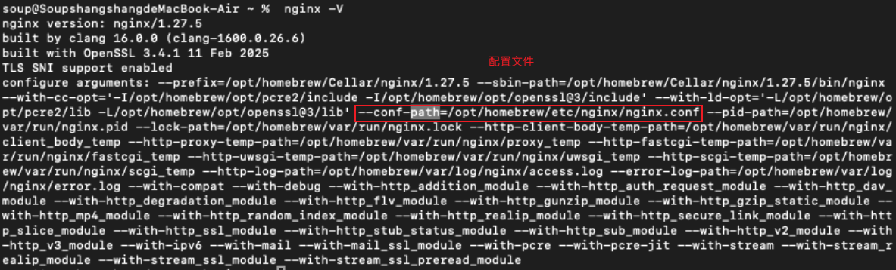

# Nginx-下

https://www.w3ccoo.com/nginx/nginx_intro.html

## 一、命令：

### nginx -V  查看nginx的配置信息



### nginx -t 测试nginx_conf是否通过

### nginx -s reload 重新加载配置文件

### nginx -s stop 停止nginx服务

### nginx  启动nginx

## 二、配置

/opt/homebrew/etc/nginx/nginx.conf：nginx的配置文件

/opt/homebrew/var/www：资源默认文件夹

### 1、mine.type文件

文件在：/opt/homebrew/etc/nginx

```
http {
    include       mime.types;
    # 是nginx用来定义文扩展名（.html .js .png）与MINIE类型映射关系的配置文件，nginx依赖它来配置HTTP响应的content-type头，却好浏览器能正确处理这些文件

}
```

mime.types


常见的MINE类型

#### 1.1 application/x-www-form-urlencoded

表单默认提交方式，

数据格式：`key1=value1&key2=value2`

```
fetch("/api/login", {
  method: "POST",
  headers: {
    "Content-Type": "application/x-www-form-urlencoded",
  },
  body: "username=John&password=123456",
});
```

#### 1.2 multipart/form-data

分块传输，文件上传


```
const formData = new FormData();
formData.append("username", "John");
formData.append("avatar", fileInput.files[0]);

fetch("/upload", {
  method: "POST",
  body: formData,  // 自动设置 Content-Type 和 boundary
});
```


#### 1.3 三种数据传输的对比


```js
// x-www-form-urlencoded
fetch("/api", {
  method: "POST",
  headers: { "Content-Type": "application/x-www-form-urlencoded" },
  body: "key=value&key2=value2"
});

// multipart/form-data
const formData = new FormData();
formData.append("file", fileInput.files[0]);
fetch("/upload", { method: "POST", body: formData });

// application/json
fetch("/api", {
  method: "POST",
  headers: { "Content-Type": "application/json" },
  body: JSON.stringify({ key: "value" })
});
```

### 2 、keepalive_timeout

一个tcp链接中可以等待的最长空闲时间，默认值75秒

### 3、核心配置指令

#### 3.1 listen：监听的端口

#### 3.2 server_name

一个ip可以绑定多个域名，可以在hosts文件中设置（模拟一个ip映射多个资源的情况）


server_name配置域名，实现多个域名访问同一个ip，但是访问的是不同的资源

server_name:_;  表示该虚拟主机为默认服务器

#### 3.3 root和alias

`alias` 会 **完全替换** 匹配的路径部分，而不是拼接。


例子： 


http://8.134.38.38/static/index-CHcREjTY.js

#### 3.4 location

路由匹配规则：https://www.w3ccoo.com/nginx/nginx_command_localhost.html

location [=|~|~*|^~|@] pattern { ... }

##### (1) 比如：= 完全 匹配


##### (2) 重定向

请求的状态码是307


##### (3) 重写

请求的状态码是200


##### (4) try_files


##### (5) error_page

设置状态码报错页面


### 4、nginx功能1：web服务器http

参考


http：nginx http核心配置指令域，包含客户端完整 HTTP 请求过程中每个过程的处理方法的配置指令

### 5、nginx功能2&3：反向代理+ 负载均衡


##### 反向代理：nginx代替服务端为客户端提供服务，客户端不知道服务端


##### 正向代理：代理服务器代替客户端向服务器请求资源，服务器不知道客户端

都是代理作为中间值，区别就是客户端和服务端互相知不知道

##### 负载均衡：用于将网络流量或计算任务合理分配到多个服务器节点，以提高系统性能、可靠性和可扩展性。

下面是一个例子：

#### 1-后台服务

使用node在后台跑两个服务


启动


#### 2-配置nginx

##### upstream：上游模块

nginx通过代理模块的反向代理功能将用户请求转发到上游服务器租，上游模块通过制定的负载均衡策略及相关的参数配置将用户请求转发到目标服务器上。

例子：

两个节点，将流量引导两个节点上，减少服务器压力，如果那个服务器的配置更好点，可以设置权重高点

```
upstream backend {
  server 127.0.0.1:3000;
  server 127.0.0.1:3001;
}

location /api {
   proxy_pass http://backend;
}
```

#### 3-效果

浏览器运行


使用curl测试


两个端口轮训访问

## 三、example

### 1、自己的服务器：前端日志

这个配置是nginx原来带有的参数：https://www.w3ccoo.com/nginx/nginx_log_access.html


任何请求都会保存在/var/log/nginx/access.log 文件中、

##### 如何获取客户端的原始ip？

当请求经过反向代理（如 Nginx、CDN、负载均衡器）时，客户端原始 IP 会被代理服务器的 IP 覆盖。`real_ip_header` 的作用是从特定 HTTP 头中提取真实 IP。

问题：nginx.conf文件中配置了`real_ip_header X-Forwarded-For; `在日志中没有显示？

### 2、项目里面实施

http://docs.io.dreamdev.cn/front-end/engineering/log-collection.html#%E9%80%9A%E8%BF%87%E5%85%AC%E5%8F%B8%E6%9C%8D%E5%8A%A1%E5%99%A8%E8%BD%AC%E5%AD%98%E5%88%B0%E9%98%BF%E9%87%8C%E4%BA%91sls


