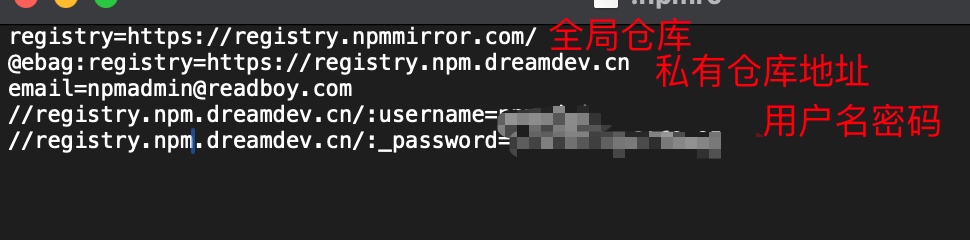

文档：https://npm.nodejs.cn/

## 一、野蛮学习

元宝search，启动！

### 1、账户

- 从公共账户里面下载包就不需要登录
- 从私有仓库中下载包就需要登录

npm配置文件位置 npm -V可以查到`/Users/soup/.npmrc`



### 2、package.json

```
常见命令
npm install 
npm install lodash --save          # 生产依赖（如框架、工具库）
npm install typescript --save-dev # 开发依赖（如构建工具、测试库）

npm uninstall <包名> # 卸载包
npm update <报名> # 升级包
```

### 3、公司获取路由配置


思考：

1、公司的私有仓库，npm私有包


get-config配置和后台管理系统

https://gitlab.dreamdev.cn/ebag/webadmin/-/tree/master?ref_type=heads


2、基础构建公司项目命令

```
npm init @ebag/vue@latest
```

3、ci配置中也有npm相关


