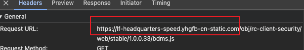

#  CDN

content delivery network

内容 分发 网络

## 一、网络

**网路是由若干节点和链接这些节点的链路构成。**

- 网络组成

  

- 网络架构

  1. 客户机/服务器（C/S）架构

     比如港澳通行证自助签注机器，设备又老又慢，更新换代很麻烦，维护和升级成本高、难度大，但是信息安全控制能力强，这个就是客户机

  2. 浏览器/服务器（B/S）架构

  这两种本质上都是：通过 <u>请求-响应</u> 来获取资源

- 网络功能

  1. 资源共享
  2. 数据传输和通信
  3. 提供网络服务：域名转换成ip、为网络中的设备分配ip等网络参数

- 网络协议：规定数据在网络中如何传播的规则

  1. **TCP/ip**：TCP 负责保证数据传输的可靠性，IP 负责实现数据的路由和寻址。
  2. **http协议**：超文本传输协议
  3. **ftp协议**：文件传输协议，服务器与客户机进行文本传输

## 二、什么是cdn

是由商业机构搭建的网络基础设施，一套标准的cdn会有自己的dns系统，因为它需要解析到边缘节点。

cdn是由全球多个服务器节点组成的网络，这些节点会缓存你网站的静态资源。

当用户访问你的网站时，**资源会从离用户最近的节点（而非你的原始服务器）加载**，从而显著加快速度。


## 三、cdn的工作原理

静态资源的生命周期

部署到源服务器 》 》首次请求触发cdn缓存 》》后续请求命中cdn缓存 》》缓存过期后回源更新

整个跟节点网络的工作原理有关

- 资源分发

  前端开发者将静态资源上传到 CDN 提供商的服务器，CDN 会将这些资源复制到全球各地的节点服务器上。

- 用户请求

- 节点选择

  cdn找到离用户最近的节点服务器

- 资源返回

  节点将缓存的资源返回用户

## 四、cdn的作用

- 加速资源加载
- 降低服务器压力
- 全球覆盖

## 五、如何使用cdn

- 直接使用公共cdn的资源

  ```js
  <script src="https://cdn.jsdelivr.net/npm/jquery@3.7.1/dist/jquery.min.js"></script>
  ```

- 托管自己的资源

  将项目构建后的静态文件（如 `dist/` 目录）上传到 CDN，并在 HTML 中替换资源链接

  ```js
  <!-- 本地路径 -->
  <script src="/js/app.js"></script>
  <!-- CDN 路径 -->
  <script src="https://cdn.yoursite.com/js/app.js"></script>
  ```

  常见cdn服务商

  - 公共库 CDN：**jsDelivr**、**UNPKG**、**Google Hosted Libraries**
  - 商业 CDN：**Cloudflare**、**Akamai**、**AWS CloudFront**
  - 开源方案：**Self-Hosted CDN**（需自建节点）

## 六、通过cdn获取缓存内容的过程

 cdn将对源站的请求导向了距离用户较近的最优缓存节点，而非源站。（针对静态资源）


GSLB：Global Server Load Balance 全局负载均衡服务器

​	主要功能是根据用户本地dns的ip地址**判断用户位置**，筛选出距离用户较近的本地负载均衡系统，并将该**SLB的ip地址作为结果返回给本地dns**

SLB：Server Load Balance 对集群内物理主机的负载均衡

​	判断缓存集群中是否有用户请求的资源数据，如果有缓存，将**http请求重定向到最优的缓存节点**上 


举🌰：

用户向www.example.com请求http资源

1. 首先向本地dns迭代获取www.example.com的ip地址
2. 如果没有，就向**根域名服务器发**送dns查询报文
3. 根dns发现域名前缀是com，给出负责解析com的**顶级dns**的IP地址
4. 本地dns想顶级dns发送dns查询报文
5. 顶级dns发现前缀是example.com，在本地记录中找到负责该前缀的**权威dns**的IP地址回复
6. 本地dns向权威dns发送dns查询报文
7. 权威dns查找到NAME为www.example.comde CNAME 记录，value值是cdn.www.example.com，并找到NMAE为cdn.www.example.com的A记录，最终找到**DGSLB的ip地址**
8. GSLB根据请求的ip地址判断用户的大致位置在北京，找到合适的**SLB的ip地址**写入DNS回应报文，最为dns查询结果返回
9. 客户端根据IP地址向SLB发送请求
10. SLB根据筛选出最优的缓存节点后回应客户端请求（状态码为302，重定向节点为最优缓存节点的ip地址）
11. 客户端接受到SLB的http回复后，重定向到该节点
12. 缓存节点判断请求的资源是否存在、过期，返回或者到源站刷新数据再回复

其实就是，如果本地dns没有这个域名的对应关系的话，会走这么四圈

- 找到GSLB的ip地址
- 找到SLB的ip地址
- 找到缓存节点的ip地址
- 缓存节点没有缓存的话向源站 更新缓存返回

## 七、思考

### 1、什么是局域网？

一个网络结构，但涉及的范围不大：一座大楼、一个校园范围内的网络

这里可以再拓展到网络的分类。

- 按范围分类
  1. 个人域网：便携式电器与网络通信设备之间短距离通信，如蓝牙耳机和手机链接就形成个人域网
  2. 局域网：一组计算机和其他硬件设备在物理地址上彼此相隔不远的范围，如一座大楼、一个校园
  3. 城域网：覆盖范围一般为一个城市或地区
  4. 广域网：物理地址范围更大，如：一个国家、地区
- 按传输介质分类
  1. 有线：采用有线传输介质连接网络设备，如双绞线、同轴电缆和光纤等
  2. 无线：采用无线传输介质，包括无线电波、微波和红外线等，如wifi、蓝牙

### 2、网站的静态资源一开始就会在节点服务器还是在源服务器？

网站的静态资源最开始是存储在源服务器上的，cdn的节点服务器还没有这些资源。

用户首次请求后，cdn才会从源服务器缓存资源到节点服务器。

举个🌰

1. **用户首次请求资源**
   - 假设用户 A 访问你的网站，请求 `https://cdn.example.com/js/app.js`。
   - CDN 发现该资源在节点服务器上没有缓存，于是回源（向源服务器）拉取资源。
   - 资源从源服务器传输到 CDN 节点，并缓存下来，同时返回给用户 A。
2. **后续用户请求同一资源**
   - 用户 B 访问同一页面时，CDN 会直接返回节点服务器上已缓存的 `app.js`，无需回源。
   - 这显著减少了加载时间，尤其是对远距离用户。

### 3、引申第2问：这样会导致一个问题，用户首次访问总会向源服务器缓存，势必速度会降下来，如何提前缓存到cdn节点？

- 手动预热

  部分cdn服务商提供“预热”功能，允许开发者手动触发资源缓存到节点。

- 版本化文件名

  1. **有版本控制**：当资源的**<u>*版本号发生变化*</u>**时，CDN 节点会将其视为新的资源请求，主动从源服务器获取新资源并更新缓存。例如，当把 `styles.css?v=1.0` 更新为 `styles.css?v=1.1` 时，CDN 节点接收到对 `styles.css?v=1.1` 的请求，会主动从源服务器获取该资源并缓存。
  2. **无版本控制**：CDN 节点主要依赖缓存*<u>**过期时间**</u>*来判断是否需要从源服务器获取新资源。如果缓存未过期，即使源服务器上的资源已更新，CDN 节点也会继续提供旧的缓存资源，直到缓存过期才去源服务器获取最新资源。

- 基于源站通知更新

  源站可以主动通知 CDN 节点某些内容已经更新，CDN 节点收到通知后会及时更新缓存

### 4、是否存在多级节点服务器？

存在，边缘服务器有两种关联源服务器的方式，


中间节点：位于区域中心，负责聚合多个边缘节点的请求

一些 CDN 服务商会采用**多级缓存架构**

### 5、cdn是针对静态资源的吗？

是的！静态资源一般是在发版的时候会不同。动态资源是实时的，很少用于缓存。

### 6、当不使用cdn，dns网络请求是一个怎样的过程？

**不使用cdn，那么就是找到域名对应的ip地址，直接向源站请求获取资源的过程**

用户输入example.com后，会经历以下的过程：

1. 客户端先在`本机的hosts文件查`找域名对应的ip地址

2. 本机hosts文件没有，会进入到`本地dns`查找

   本地DNS：用户设备或本地网络中配置的DNS服务器

   操作系统DNS缓存、路由器DNS、本地网络中的DNS服务器、DHCP分配的DNS服务器、手动配置的DNS服务器

3. 如果本地没有，就会依次向根DNS、顶级域DNS、权威DNS进行询问

**使用cdn，dns找到的最终ip地址，可能是节点服务器的ip地址，也可能是源站的ip地址，在返回这个ip地址，向他请求资源**

## 八、实际操作

### 1、查看公司的文件存储

七牛地址：https://portal.qiniu.com/signin
七牛账号：cjf@dream.cn
七牛密码：ghq#@!6

#### 1.1 公司的bucket

#### （1）创建源服务器（空间/bucket）

可以指定服务器的位置


#### （2）总揽其中的一个空间：rbebagdata


#### （3）进入到rbebagdata空间，查看到存储的所有文件


可以查看到项目中用到的katex.js文件

https://ziyuan.ebag.readboy.com/katex/0.16.7/katex.min.js


#### （4）进入域名管理栏

创建bucket后，七牛云会提供一个免费的测试地址可以访问，但是只有一个月试用期。测试正式环境需要有域名可以访问到这个bucket。


有两种方式绑定：

​	自定义 CDN 加速域名：通过cdn的方式加速访问

​	自定义源站域名：直接访问到bucket，即直接访问源服务器

- 点击绑定域名

  这里需要有域名，就需要去购买域名，根据域名后缀、服务、年限不同价格也会不一样

  

  

#### （5）进入 ziyuan.ebag.readboy.com域名


可以设置访问这个域名的一些配置，加速cdn访问

#### 1.2 什么是CNAME？

现在是一个bucket有多个域名，在访问域名时如何对应到bucket，CNAME就是处理这种映射关系。

定义：CNAME是DNS（域名系统）中一种记录类型，将域名的别名指向另一个域名（规范域名）。

比如：

你有一个域名`cdn.example.com`，要它指向主域名`example.com`，可以给`cdn.example.com`设置一个CNAME（ `example.cdnprovider.com`）。即`cdn.example.com` => `example.cdnprovider.com` => `example.com`

**CNAME只有一个起别名的作用**，CNAME和cdn是两种行为

- CNAME 解析的流程

  用户访问 `cdn.example.com`，浏览器向 DNS 查询 `cdn.example.com` 的 IP 地址。

  1. DNS 解析

     DNS 发现 `cdn.example.com` 有一条 CNAME 记录指向 `example.cdnprovider.com`。

     DNS 继续查询 `example.cdnprovider.com` 的 IP 地址，并返回给浏览器。

  2. **请求发送到 CDN 节点**

     浏览器向 `example.cdnprovider.com` 的 IP 地址（即 CDN 节点）发起请求。

- cdn的行为

  如果 CDN 节点没有缓存资源，会根据你配置的源站地址回源拉取资源。

  1. 访问`cdn.example.com/app.js`CNAME到`example.cdnprovider.com`
  2. `example.cdnprovider.com` 指向离用户最近的 CDN 节点服务器
  3. 节点没有缓存，再到`example.com`

#### 1.3 拓展：A 记录是什么

A记录是DNS中的一种记录类型，将域名直接映射到IPv4地址，用户可以通过访问域名访问服务器。

A记录的实例：

假设你有一个域名 `example.com`，并希望将其解析到服务器的 IP 地址 `93.184.216.34`，你可以设置以下 A 记录：

- **主机名**：`example.com`
- **记录类型**：`A`
- **值**：`93.184.216.34`
- **TTL**：`3600`（单位：秒）

使用场景：

1. 网络托管

   将域名托管到服务器ip地址：`www.example.com` → `93.184.216.34`

2. 子域名指向不同服务器

   - `blog.example.com` → `192.0.2.1`
   - `shop.example.com` → `192.0.2.2`

3. **负载均衡**

   为同一个域名设置多个 A 记录，指向不同的服务器 IP 地址，实现简单的负载均衡。例如：

   - `example.com` → `192.0.2.1`
   - `example.com` → `192.0.2.2`

`A 记录只能用于 IPv4 地址。如果需要支持 IPv6 地址，需要使用 AAAA 记录。`

#### 1.4 CNANE和A记录之间的关系

假设有这样子的配置

- A记录：example.com -> 192.0.2.1
- CNAME：cdn.example.com  -> www.example.com -> example.com

当用户访问cdn.example.com时

1. DNS查找cdn.example.com，发现有条CNAME：www.example.com，就在节点服务器上找资源
2. 没有找到，继续往下找，CNAME指向example.com
3. DNS再找expamle.com，发现它是一个A记录，指向192.0.2.1
4. 最终返回192.0.2.1

看下公司的

有个CNAME

#### 1.5 拓展：操作绑定cdn域名

假设我在阿里云上购买了域名example.cn，这个域名已经备好案了，它的多级域名就不用再备案了。我想用aa.example.cn这个域名去作为加速域名，加速访问七牛云上的bucket的资源


这时候，七牛云厂商就会对这个aa.example.cn创建一条CNAME，需要在阿里云的域名列表中将aa.example.cn链接这个CNAME。

当我们访问到aa.example.cn，实际上就是查到CNAME，就被七牛云托管了，可能会有往下继续查找整个链路。


----------看下公司的域名

公司在阿里云上有一个域名strongwind.cn

这里配置的直接就是权威dns


可以查看到在这个域名下，设置了很多 多级域名 作为A记录、CNAME

在七牛云中可以查到有很多这个域名的配置项

点进去rbebag-zy-test.strongwind.cn，在这个域名下就有这个七牛云给出的CNAME：iduz9e7.qiniudns.com

在阿里云的这个域名列表中就可以查到它的对应关系

通过dig命令查找，当我访问rbebag-zy-test.strongwind.cn的时候，整一条dns的链路

```
dig rbebag-zy-test.strongwind.cn
```


1. rbebag-zy-test.strongwind.cn CNAME 到 iduz9e7.qiniudns.com

2. iduz9e7.qiniudns.com CNAME 到 allcdn.china.qiniu.qnydns.com

3. allcdn.china.qiniu.qnydns.com CNAME allcdn.lv2.qnydns.com

4. 查找到allcdn.lv2.qnydns.com有两个A记录，说明有两个节点都有资源，实际提供服务的服务器的 IP 地址

   有两种情况

   - cdn：两个cdn节点都有资源
   - 负载均衡：源服务器的两个ip都有部署

#### 1.6 本地的一个端口可以设置一个A记录吗？

概念混淆了

A记录是在DNS中的资源记录类型，域名对应ip4地址的这种映射关系是在DNS服务器中配置的，localhost对应的127.0.0.1是在本地系统的hosts文件中配置的。

#### 1.7 一个bucket为什么需要设置那么多个加速域名？

观察掘金社区：

- css文件访问域名

  

- js文件访问域名会不同

  

  

  

- imge文件访问域名会不同

  

  

解答：

1. 关键原因：提升性能和用户体验

   - 突破浏览器的并发限制

     **浏览器为了避免对服务器造成过大压力**，通常会对同一域名下的并发连接数量进行限制。

     例如，Chrome 浏览器对同一域名下的并发连接数限制一般为 6 - 8 个

     

     当网站资源较多时，使用多个加速域名可以让浏览器同时从不同域名下载资源，增加并发下载数量，从而加快资源的加载速度，提升页面的整体加载性能。

     

   - 不同资源可以设置不同的缓存策略

   - 资源加载优先级管理

     浏览器会根据资源类型和渲染需求来加载资源优先级，不用资源设置不同域名们可以更清晰地控制加载顺序。

     看掘金首页，顺序大致是 css 》js 》图片 》请求 

2. 根据上面的观察，是对不同资源类型的适配

   添加cdn域名的时候，会有不同的策略，资源策略

   

   对于图片资源，可以使用专门的图片加速域名，并设置较长的缓存时间，减少图片的重复下载；

   对于动态脚本资源，可以使用另一个加速域名，并设置较短的缓存时间，确保用户能够及时获取到最新的脚本内容。

3. 满足业务和运营要求

   根据业务、地域、用户群体的不同可以对域名进行优化

4. 提高安全性

   当有一个域名被攻击了，DDOS攻击、CC攻击，还可以使用其他域名去访问

**<u>*引申 》》为什么浏览器会有对域名访问的限制？跳转《http:为什么浏览器对同一域名的访问有限制.md》*</u>**

### 2、在公司项目中，使用cdn和不使用cdn，看看获取资源的速度差异


每个地址加载了三次平均数据显示

- 源站图加载数据

  

  到20.2秒完成加载

- cdn加速访问

  

  

  到18.7秒完成加载

### 3、使用阿里云的oss存储自己操作一个bucket


申请域名好麻烦就不搞了
