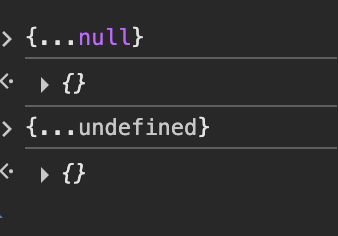
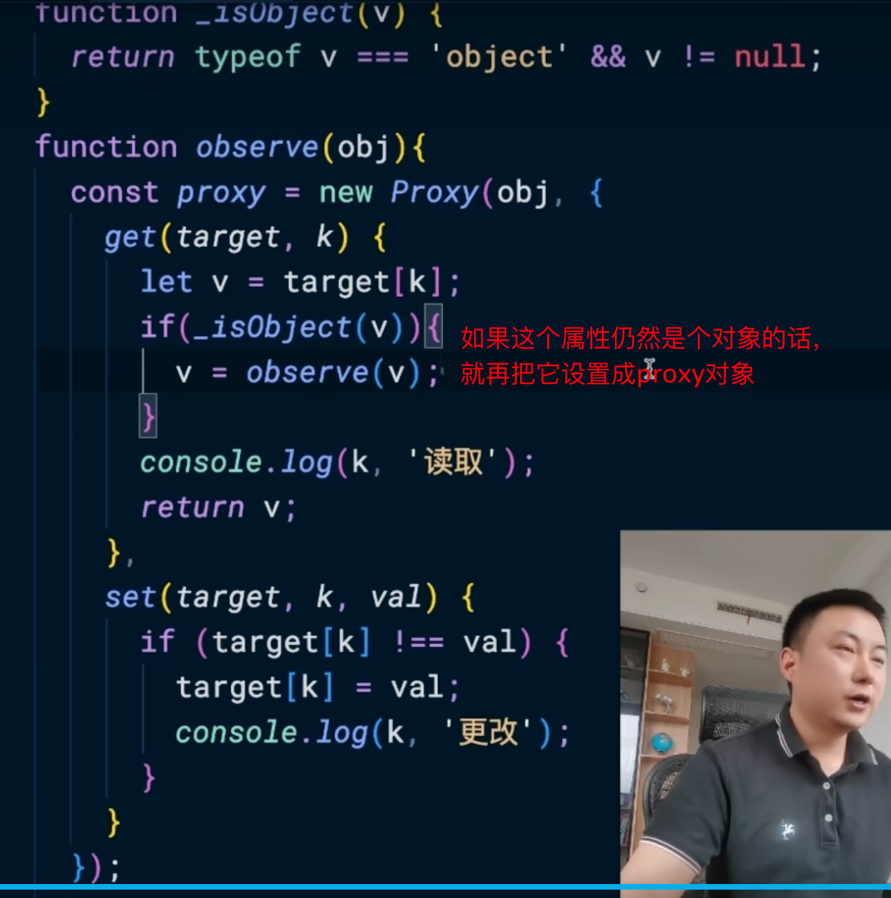

# 面试记录

## **数字马力 5/16**

### 1、面项目比较多

​	<u>micro-app原理</u>

​	核心在于将一个大型的项目，拆分成一个个小的独立灵活的项目，独立开发、独立部署， 降低开发成本，减少项目之间的耦合

- micro-app初始化

- 路由配置

- 数据传递

  主应用 -> 子应用

  ```js
  主应用  <micro-app :data="appData"></micro-app>
  子应用
  window.microApp.addDataListener((data) => {
      console.log('收到数据:', data.user.name) // John
    })
  ```

  子应用->主应用

  ```js
  子应用 window.microApp.dispatch({ type: 'event', payload: '数据内容' })
  主应用
  // 主应用监听
  microApp.setDataListener('child-app', (data) => {
    console.log('子应用上报:', data.payload)
  })
  ```

​	<u>js-brige跟安卓&平板适配不</u>

​	应用使用flutter进行开发，可以多端打包，去适配不用的系统，jsbridge可以适配，如果出现了兼容问题，一般都是由应用端去解决

### 2、基础

​	一点js的结构：{...undefined} {...null} ✅



​	1+0.2 === 3

​	小算法：字符串找指定下标

​	针对vue的性能优化 ✅

​	vuex和pina的区别

​		vuex的响应式是结合vue2的响应式系统

​		pina是vue3的proxy代理响应，有更简洁的api，使用vue3的组合式api

​	父子组件传数据

​	vue双向绑定原理

​	webpack和vite打包的区别

​		webpack全量打包，vite按需打包

​		vite打包速度会更快

​		

### 3、其他

​	<u>问在这里的公司的突出收获？</u>

​	技术：

​		精进vue3+vite的理解，也会看同事写的代码，接触到工程化的东西，比如：ci、自动化部署、docker镜像、cdn的东西，七牛云阿里云这些。	

​		公司也有技术文档，都是根据公司的实际情况优化输出的东西，会有应用场景，我就会主动去要一些账号密码去登录公司的云产品去看一看；gitlab是自己部署的，要管理员账号去看看，有什么权限和功能。	 	

​		 独立解决问题的能力：比如说一个浙里办的项目，用vite打包会出现路由解析问题，就直接转成webpack打包							  小程序会不兼容flex布局的gap属性，es6语法不兼容，使用es6转成es5							  有一次下午两点中要演示项目，中午团队协同更新一个需求，整个中午都在上线和测试

​	项目：

​		参与和推进项目的进行，参与过多端的开发，独立开发和共同开发项目，提高了独立开发和协同开发的能力

​		因为参与的项目比较多，在理解需求之后，接触到新的项目可以很快上手开发

​	软技能：

​		沟通能力的提高

​	<u>为什么离职？</u>

​	（不涨薪；大小周；公司正在转型中，管理混乱，从生产转向互联网。）

​	**避雷：不要指责老东家**

​	（大小周）

​	（在选择公司上主要还是看中个人发展，想要更好的发展机会，能去接触更加专业的团队，个人的发展跟环境是分不开，如果有更好的一个晋升途径话，我就会去选择。看看有什么更好的发展机会。）

​	<u>工作强度高的话能不能担任？</u>

​	（互联网加班是不可避免的，任何职业都会存在加班的现象）

​	（项目紧张或者开发上线的时候，肯定要加班的，但是我也拒绝无效加班和内卷）

​	（分析下，是否在业务开发中可以减少时间的花销，减少无效开发，沟通使用通用业务的代码组件）

​	<u>在工作强度高的情况下怎么保证自己的自我提升？</u>

​	在实践中学习

​	空余时间会看技术文章

​	加一些纯技术的群，会参与网友抛出的问题

### 4、提问

​	<u>贵公司的开发流程是怎样的？</u>

​	<u>贵公司的离职率如何？</u>

​	前端团队有多少人，整个团队的构成？


## 趣印 6/13

### 1、面技术会比较多

### 1-1 <u>vuex和pina的区别，pina有什么优化</u>

详见：/doc/2框架/4-状态管理工具.md

### 1-2 <u>你用vue3的proxy对你有什么好处</u>？或者说，vue3和vue2的区别

#### 1 响应式的优化

##### vue2的响应式

1. vue2的响应式

   ```js
   function defineReactive(obj, key, val) {
     const dep = new Dep(); // 依赖管理器
     Object.defineProperty(obj, key, {
       get() {
         if (Dep.target) { // 当前Watcher
           dep.depend();   // 收集依赖
         }
         return val;
       },
       set(newVal) {
         if (newVal === val) return;
         val = newVal;
         dep.notify(); // 通知所有Watcher更新
       }
     });
   }
   ```

   使用object.defineProperty重写数据的set跟get，每一个属性都有一个依赖管理器dep，当使用到这个属性的时候，也就是调用到get，在这里往dep push一个watcher，然后更新数据的时候，会调用到set，那么这时候，dep的所有watcher都去notify去更新。

   调用到属性的场景有：watch、computed、页面渲染，这时候就会触发这些场景去更新。

​		深度遍历每一个属性，为每一个属性劫持他的set、get

2. 局限性：

   数组的数据变化无法被监听到

   新增的属性也无法被监听到

3. 如何解决？

   vue2使用**`Object.defineProperty`**去劫持对象的属性，无法监听到数组的下标、length和数组原生方法如push、pop。

4. 所以vue去重写了数组的原生方法

```JS
this.items.push(newItem);     // ✅ 触发更新
this.items.splice(index, 1);  // ✅ 触发更新
```

5. 显示触发更新

```js
// 强制更新
Vue.set(this.items, index, newValue);

// 重新赋值
this.items = [...this.items, newItem]
```

##### vue3的响应式

- 响应式

  使用proxy去代理整个对象，拦截所有操作（读/写/删/查）

  

  什么是reflect，和proxy？

  同样是在set的时候时候收集依赖，在get的时候通知更新

   

  在这一步 if(_isObject(v))是一个递归

- vue3的ref和reactive的区别

  1. ref是劫持属性的.value

     ```js
     class RefImpl<T> {
       private _value: T;         // 存储当前值
       private _rawValue: T;      // 存储原始值（用于比较）
       public dep: Dep = new Set(); // 依赖集合
       public readonly __v_isRef = true; // 标记为 ref 对象
     
       constructor(value: T) {
         this._rawValue = value;
         this._value = isObject(value) ? reactive(value) : value; // 对象类型转为 reactive
       }
     
       get value() {
         track(this, 'value'); // 依赖收集
         return this._value;
       }
     
       set value(newValue: T) {
         if (hasChanged(newValue, this._rawValue)) { // 值变化检查
           this._rawValue = newValue;
           this._value = isObject(newValue) ? reactive(newValue) : newValue;
           trigger(this, 'value'); // 触发更新
         }
       }
     }
     ```

     如果ref的值是原始值，就直接代理这个 this._value = value

     如果reactive是引用值，就设制成 this._value = reactive(valeu)

### vue3解决了什么问题/带给你什么好处？

1、vure3使用proxy的方式代理了组件的属性，监听到了数组的下标和和原生原生方法，无需在使用数组的时候手动更新页面

2、代码组织和逻辑复用不同

写法上，vue2使用option API，属性和方法写在data、methods上，跟功能是割裂开的

vue3使用了composition API，代码和功能是聚合的，可读性高

使用usehooks代替了vue2的mixins

3、减小打包的体积，优化tree-shaking

### 1-3 <u>大屏适配的公式</u>

使用rem方式

- 将px转成rem

  **`postcss-pxtorem`**

  ```js
  module.exports = {
    plugins: {
      'postcss-pxtorem': {
        rootValue: 192,          // 基准值：设计稿宽度/10（如375px设计稿 → 37.5）
        propList: ['*'],          // 所有属性都转换
        selectorBlackList: ['.no-rem'], // 忽略转换的选择器（如排除第三方UI库类名）
        unitPrecision: 5,         // rem保留5位小数
        minPixelValue: 2,          // 小于2px不转换（避免微小尺寸变形）
        mediaQuery: false         // 媒体查询中的px不转换[2,6](@ref)
      }
    }
  };
  ```

  设计稿是1920px，假设元素的大小全部是设计稿中的数值

  那么，rootValue设置成192

  假设一个元素的宽度是100px，那么就是100 / 192 = 0.52rem，如果说屏幕宽度正好是1920px，那么这个元素的宽度就是0.52rem

- 计算rem

  ```js
  // rem.js
  let baseSize = 192
  function setRem() {
    const scale = document.documentElement.clientWidth / 1920; // 基于设计稿宽度 1920
    document.documentElement.style.fontSize = baseSize * Math.min(scale, 2) + 'px';
  }
  window.addEventListener('resize', setRem);
  ```

  如果屏幕变化了，计算出与设计稿的相对值，重新计算fontSize，那么就是0.52去乘这个新的fontsize

### 1-4 <u>Micro-app怎么改变子应用的div元素，这个你是自己封装的还是用别人写好的</u>

/doc/4项目业务/2-项目学习/micro-app.md

### 1-5 <u>Vite的部署优化：rollup定义大小</u>

### 1-6 <u>路由拦截</u>

### 2、提问

开发流程

团队组成情况


问工作时间？

薪资：我这个年限的工作经验，在你们公司的薪资范围是多少呢？


# 总结：

1、找工作是双向选择的，你要看这家公司合你的眼不？环境什么的

2、简历优化：不要写太多的技术点，针对写的东西去研究